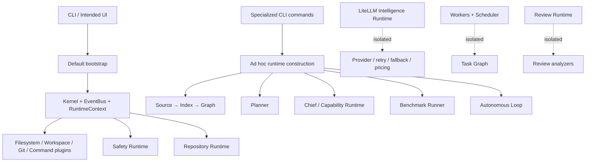
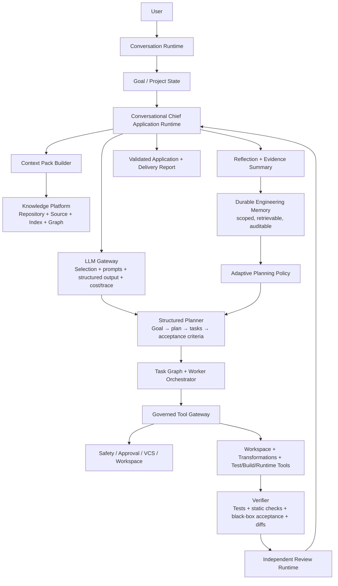
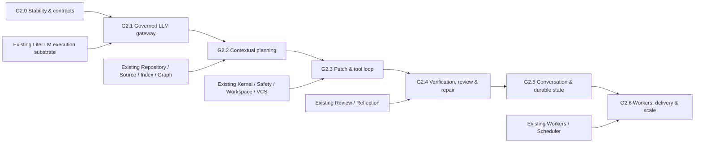

# EAG Generation 2 Readiness Report

**Assessment baseline:** `main` at commit `1868e5c9a1d1d258d17ec993c437dfcba5401bd6` (5 August 2026)
**Assessment type:** Non-invasive repository reconnaissance, execution audit, and Gen2 implementation planning
**Author:** Manus AI
**Scope note:** No source code was edited, no commits were created, and nothing was pushed. A temporary virtual environment was created by the locked project test command and is ignored by Git. An isolated external workspace was used only to reproduce the recorded knowledge-base build artifact.

> **Evidence convention.** **FACT** is directly verified from repository code, documentation, Git history, tests, or observed command output. **INFERENCE** is a conclusion drawn from that evidence. **RECOMMENDATION** is a future-oriented design or delivery proposal. Repository links are pinned to the assessed commit unless a historical milestone commit is specifically cited.

---

## 1. Executive Summary

**FACT.** EAG is a substantial Python engineering-platform codebase: the assessed tree contains 443 source files under `src/eag`, 34 top-level package areas, a Typer CLI, 100+ test files, typed domain models, repository/source/index/graph subsystems, planning, workspace and Git abstractions, safety, review, workers, scheduler, reflection, memory, adaptive planning, an autonomous loop, and a LiteLLM-backed provider abstraction. Its project metadata declares version `0.8.0`, while repository documentation and tags describe a later Generation 1 milestone; that version discrepancy is itself a release-governance signal. [1] [2]

**FACT.** The repository has genuinely built a **deterministic engineering operating-system foundation**. The kernel boot path registers filesystem, workspace, Git, and command plugins; repository inspection, source analysis, index/graph construction, command policy, workspace operations, Git operations, planner models, and several runtime-specific tests are real implementations. The full test suite nevertheless does **not** pass at the assessed commit: `3342 passed, 1 skipped, 8 failed, 62 errors`. The dominant failure mode is a stale autonomous-loop constructor contract, while three Git-related tests fail because ANSI colour codes are returned in Git output. Static quality gates also fail: Ruff reports 18 findings and MyPy reports 9 errors. [3] [4]

**FACT.** The advertised autonomous build path is not yet autonomous software generation in the product sense. `eag build` routes known goals to a deterministic `DefaultPlanner`. A phrase containing `knowledge base` or `fastapi` receives a hardcoded nine-step FastAPI/SQLite/Docker plan containing literal source strings; unknown goals receive a three-step Git/README/commit fallback. The plan is then executed sequentially through only workspace and repository capabilities. No model-selection, LiteLLM-execution, worker, source-intelligence, graph, review, or safety runtime is assembled by that path. [5] [6] [7]

**FACT.** The LiteLLM integration is real but isolated. It can issue a non-streaming completion, returns token counts, and has standalone retry, fallback, pricing, health, and trace machinery. However, no production source outside the intelligence package constructs `IntelligenceRuntime`, `ExecutionRuntime`, or `LiteLLMProvider`; the `eag build` path does not invoke them. Thus, Generation 1 contains an LLM adapter, not an LLM-driven Chief. [5] [8] [9] [10]

**INFERENCE.** The principal Gen2 bottleneck is **not a missing user interface** and not merely “more workers.” It is the absence of an integrated, governed **reasoning-to-artifact loop**: there is no production path that turns repository-aware context plus a user goal into an LLM-produced structured plan, reviewed patches, executable tests, evidence-based completion, and iterative repair. Template selection can demonstrate orchestration mechanics, but it cannot establish general engineering capability.

**RECOMMENDATION.** Gen2 should begin with a short **reality and contracts stabilization sprint**, then introduce a single Chief composition root that integrates an LLM gateway, structured planning, context assembly, capability/tool execution, patch synthesis, verification/review, durable memory, and conversational state. The existing deterministic platform should remain the control plane and safety envelope; it should not be replaced with an unstructured prompt wrapper.

| Readiness dimension | Assessment | Evidence-based interpretation |
|---|---|---|
| Deterministic platform foundation | **Strong** | Kernel, plugins, repository/source/index/graph, workspace, execution, safety, models, and tests are material implementations. |
| Autonomous goal-to-product capability | **Prototype only** | Known goals select inline templates; unknown goals create only a README and Git commit. |
| LLM-backed reasoning | **Present but disconnected** | LiteLLM provider/runtime exists, but the Chief/build paths do not reference it. |
| Benchmark credibility | **Low for engineering autonomy** | Templates and structural metadata create 100/100 outcomes without running generated tests. |
| Continuous learning / adaptation | **Prototype only** | Memory is in-process and adaptation is deterministic rule insertion; the build composition does not activate adaptive planning. |
| Gen2 starting position | **Favourable after stabilization** | The architectural primitives are worth preserving, but the product loop must be made real before UI/deployment work. |

---

## 2. Current Repository Architecture

### 2.1 Actual package map

**FACT.** The assessed source tree is organized around explicit domain packages rather than a monolithic agent module. The largest areas are `chief` (60 Python files), `source` (56), `planner` (45), `execution` (28), `plugins` (25), `graph` (20), `workers` (15), and `workspace` (14). The repository also contains separate packages for adaptive planning, autonomous loop control, approval, benchmark, capability, changesets, index, memory, reflection, review, scheduler, task graph, VCS, and repository analysis. [1]

| Layer or concern | Principal implementation areas | What actually exists |
|---|---|---|
| Kernel and shared infrastructure | `kernel`, `core`, `events`, `config`, `registry`, `plugins`, `logging` | Kernel lifecycle, `RuntimeContext`, in-process `EventBus`, configuration, capability registry, and built-in plugins. [7] [11] |
| Knowledge and repository understanding | `repository`, `source`, `index`, `graph`, `explorer`, `vcs` | Repository scanning/profiling, Python AST analysis, symbol/index construction, graph queries, repository/Git abstractions, and CLI exploration commands. [5] [12] |
| Planning and execution models | `planner`, `changeset`, `execution`, `session`, `workspace`, `approval`, `safety` | Deterministic goal analysis and plans, validation, simulation/approval models, changesets, command policy, workspace/VCS operations, and execution runtime abstractions. [6] [13] |
| Chief and capability plane | `chief`, `capability` | A Chief wrapper, coordinator, runtime registry, sequential plan scheduler, capability registry/dispatcher, workspace/repository/transformation/review capabilities. [6] [14] |
| Intelligence and provider infrastructure | `chief/intelligence` | Selection/routing models, provider registry, LiteLLM provider, retries, fallback, pricing, metrics, and trace objects. [8] [9] |
| Organization and autonomy | `workers`, `scheduler`, `task_graph`, `review`, `reflection`, `memory`, `adaptive`, `autonomous` | Worker registry/runtime, parallel scheduler, review pipeline, deterministic reflection, in-memory memory, rule-based plan mutation, recovery/approval/completion loop. [15] [16] [17] [18] [19] |
| Evaluation and presentation | `benchmark`, `cli`, `tests`, `docs` | Benchmark runner/evaluator/reporter, CLI commands, extensive test suite, roadmap, constitution, architecture, and historical architecture documents. [5] [20] [21] |

### 2.2 Actual default composition versus documented composition

**FACT.** The default `bootstrap()` composition root creates an event bus, capability registry, approval components, a Git-backed safety runtime, a repository runtime, and four plugins: filesystem, workspace, Git, and command. It does **not** construct the source, index, graph, planner, Chief, worker, scheduler, review, memory, adaptive, autonomous, or intelligence runtimes. Individual CLI commands construct some of those components directly on demand. [7] [5]

**INFERENCE.** The architecture is best described as a set of **well-factored platform subsystems with several alternative composition roots**, rather than one fully assembled runtime graph. This is a useful Gen1 foundation, but it creates a material integration risk: each top-level command can silently use a different subset of safety, knowledge, and execution services.



### 2.3 Architectural strengths that should be retained

**FACT.** The documented principles of separation between facts, reasoning, and execution; immutable models; explicit runtime ownership; protocol boundaries; explainability; benchmark-driven development; safe workspace operations; controlled repository operations; and approval gates are consistently reflected in much of the package layout and model-oriented design. [12] [22]

**RECOMMENDATION.** Preserve these principles as Gen2 invariants. In particular, Gen2 should retain typed, immutable plan/patch/review/evidence models; protocol-based providers and tools; explicit runtime lifecycle; and a mandatory policy/approval boundary around workspace, shell, VCS, deployment, and external side effects.

---

## 3. Generation 1 Delivery Audit

**FACT.** The history contains 78 commits from 7 July through 5 August 2026. Release tags track the platform’s progression from source/planning work through Chief, workers, memory, and the `v1.0.0` Gen1 milestone. The final Gen1 commit added the knowledge-base request, an ignored generated-workspace Gitlink, autonomous/adaptive changes, a build CLI command, and EBS-011/EBS-012 tests. [23] [24]

> The roadmap marks Sprints 0–8 as complete and Sprint 9 as in progress, but the final Gen1 tag and commit claim completion of an autonomous engineering platform. This report treats code and executable evidence as authoritative when those sources diverge. [20] [24]

| Sprint / milestone | Delivery classification | Verified implementation | Integration and evidence assessment |
|---|---|---|---|
| Sprint 0 — Foundation | **Fully implemented within scope** | Initial repository, documents, skeleton, configuration, and later project structure commits exist. | This is foundation work, not engineering autonomy. |
| Sprint 1 — Kernel | **Implemented and default-integrated** | Kernel, event bus, context, registry, plugin lifecycle, configuration, and CLI bootstrap are present. | `bootstrap()` is real, but its default context includes only a subset of later runtimes. [7] |
| Sprint 2 — Runtime | **Implemented but partially integrated** | Execution/session/runtime structures, metrics, and events exist. | The default boot path does not assemble the broad execution/session stack claimed in architectural documentation. [7] [12] |
| Sprint 3 — Repository / Safety | **Implemented but partially integrated** | Repository scanner, Git support, command classification/policy, approvals, checkpoints, and safety runtime exist. | Safe command handling is real in its plugin path; `eag build` independently deletes a workspace and writes through a direct filesystem branch, bypassing that composition. [5] [7] |
| Sprint 4 — Source Intelligence | **Implemented but command-local** | Python analyzer, source runtime, index, graph, explorer, semantic transforms, and query CLI commands exist. | CLI builds index/graph ad hoc. The build/Chief path does not use repository profile, source context, index, or graph to plan code. [5] [12] |
| Sprint 5 — Planning Platform | **Implemented structurally; intelligence is deterministic** | Goal analysis, plan models, validation, simulation, approvals, planner strategies, and CLI exist. | The product build path uses the separate deterministic Chief `DefaultPlanner`, not the richer planning platform as a repository-aware reasoner. [6] [20] |
| Sprint 6 — Engineering Platform | **Implemented but only partly exercised end-to-end** | Workspace, VCS, transformations, execution graph, changesets, and source transformation modules exist. | The observed product flow invokes only `workspace` and `repository` capabilities. Semantic transformations are not selected by the planner. [5] [14] |
| Sprint 7 — Chief Engineer | **Implemented but partially integrated** | Chief runtime, coordinator, sequential scheduler, capability runtime, selection/provider infrastructure, and tests exist. | Chief execution is a thin plan executor. LLM intelligence, review, workers, and memory are not composed into its public `execute_goal()` path. [6] [8] [14] |
| Sprint 8 — Workers | **Implemented in isolation** | Worker model/registry/manager/runtime, task graph, scheduler, health, collaboration metrics, and review worker exist. | No production Chief/CLI build path constructs or dispatches the worker runtime or parallel scheduler. [15] [16] |
| Sprint 9 — Learning / Autonomous Engineering | **Prototype implementation with broken compatibility tests** | Reflection, memory, adaptive planner, autonomous loop, approval/recovery/completion models, EBS-009 through EBS-012 tests exist. | The default autonomous loop runs, but it uses an in-memory store, rule insertion, optimistic completion, no review injection, and stale loop tests fail. [17] [18] [19] [25] [26] |

### 3.1 Delivery-history conclusion

**INFERENCE.** Generation 1 delivered **a broad and valuable engineering platform**, not a single fully integrated autonomous engineer. The repository has advanced beyond a skeleton: many subsystems are functional and independently tested. Yet “complete” in the roadmap/tag sense chiefly means that packages and structural flows were delivered, not that one Chief can use repository knowledge, model reasoning, workers, review, safety, memory, and recovery together on an unfamiliar software request.

---

## 4. Single Engineer Architecture Validation

### 4.1 Intended versus actual goal loop

**FACT.** The historical Single Engineer Architecture specifies an end-to-end sequence from user/interface through kernel, Chief, planner, execution, safety, knowledge, benchmark, and reflection. It also states that the Chief should route requests through models and dynamically select tools. [21]

| Intended stage | Actual status | Evidence and deviation |
|---|---|---|
| Goal | **Present** | `eag build <goal>` accepts a goal string. [5] |
| Chief | **Present, thin** | `ChiefRuntime.execute_goal()` fetches a planner and validator, requires a supplied capability runtime, and creates a fresh coordinator. [14] |
| LLM reasoning | **Isolated** | No production build/Chief references to `IntelligenceRuntime`, `ExecutionRuntime`, or `LiteLLMProvider` were found outside the intelligence package. [8] [9] [10] |
| Planning | **Deterministic template selection** | Goal keyword matching selects benchmark, knowledge-base, calculator, or generic hardcoded plans. [6] |
| Workers | **Not integrated** | The coordinator’s `TaskScheduler` is sequential plan-step ordering, not the worker/scheduler platform. [6] [15] [16] |
| Execution | **Present, narrow in product path** | Coordinator dispatches capability requests; product composition exposes only workspace and repository capabilities. [5] [6] |
| Review | **Implemented, not invoked by build** | Review runtime is a real analyzer pipeline, but autonomous reflection receives no `review_report`. [17] [18] |
| Reflection | **Present, deterministic** | It derives findings and scores from run/review/benchmark objects. With no review object, it defaults review score to 100. [18] |
| Engineering memory | **Present, ephemeral** | Build uses `InMemoryStorage`; retrieval matches only the first goal token. [5] [19] |
| Adaptive planning | **Present, not activated by build composition** | Coordinator adapts only when its separate `_adaptive_planner` argument is provided. The build command supplies `AdaptivePlanner` as its base planner but not as `adaptive_planner`, so the adaptive `plan()` method is not called. [5] [6] [25] |
| Recovery / next iteration | **Rule-driven prototype** | Completion/recovery operate on outcome and reflection thresholds; no new contextual diagnosis or plan re-synthesis occurs. [17] [27] |
| Completion | **Optimistic** | A successful step sequence plus default review score 100 yields “objective satisfied”; generated tests are not run in the build path. [6] [18] [27] |

**INFERENCE.** The implemented build path is materially different from the intended architecture. The current flow is more accurately represented as:

```text
Goal
  → keyword/template plan selection
  → sequential workspace/repository operations
  → step-success validation
  → deterministic reflection (without review)
  → in-process memory write
  → optimistic completion
```

The documented knowledge, LLM, worker, review, adaptive, and recovery layers largely exist as separate capabilities or test fixtures, but they are not active participants in this flow.

### 4.2 Coupling and interface concerns

**FACT.** Several integration boundaries are bypassed or unstable. The autonomous loop sets `self._coordinator._memory` directly; worker runtime and tests access manager/registry internals; EBS-010 and 62 other autonomous-loop test setups still construct the runtime with a former `chief_runtime`/`capability_runtime` API, while the implementation now expects a `Coordinator`. [17] [26]

**INFERENCE.** These are symptoms of composition-root and contract drift rather than isolated test defects. The immediate concern is not the number of packages; it is that integration contracts are informal, duplicated, and insufficiently covered by a small set of stable end-to-end tests.

---

## 5. Benchmark Suite Assessment

**FACT.** EBS-001 through EBS-005 are generated by `get_benchmark_plan()`, explicitly described as deterministic templates. Each benchmark embeds literal application, test, README, and `pyproject.toml` content in plan metadata. The CLI benchmark command always records `tests_pass: True` after any successful Chief run; it determines “tests exist” only by scanning root-level Python file names and never executes generated tests. [5] [28]

**FACT.** The benchmark evaluator assigns planning, execution, and recovery scores of 100 to every successful run. The remaining dimensions derive from three booleans: `tests_pass`, `readme_exists`, and `valid_structure`. This explains why observed EBS-001 and EBS-004 runs both reported 100/100 in approximately 23 ms and 18 ms respectively. [5] [29]

| Benchmark | What it actually tests | Real versus simulated | Does it demonstrate independent engineering ability? |
|---|---|---|---|
| EBS-001 — CLI Calculator | Template plan dispatch, workspace file writes, Git commit, and structural report generation. | **Real:** workspace/VCS operations. **Template-driven:** calculator and test source. **Mocked by score:** `tests_pass`. **No LLM.** | **No.** It demonstrates execution of a known plan, not goal understanding or program synthesis. |
| EBS-002 — File Organizer | Same orchestration path with a different static file set. | **Real:** writes/commit. **Template-driven:** organizer, tests, docs, manifest. **No LLM.** | **No.** No repository inspection, reasoning, or test execution is required. |
| EBS-003 — Notes CLI | Same plan mechanism for a static JSON notes module. | **Real:** writes/commit. **Template-driven:** all application artifacts. **No LLM.** | **No.** It validates a known template only. |
| EBS-004 — FastAPI CRUD | Same template mechanism for a minimal FastAPI app. | **Real:** writes/commit. **Template-driven:** only GET/POST endpoints and one GET test. **Score says tests pass without running them.** | **No.** The emitted app does not substantiate the benchmark label “CRUD” or general FastAPI engineering. |
| EBS-005 — TODO App | Same orchestration path for static in-memory functions. | **Real:** writes/commit. **Template-driven:** all source/tests. **No LLM.** | **No.** It validates known artifact materialization. |
| EBS-009 — Adaptive Learning | Cold/warm/stable rule-based plan mutation. | **Partly real:** coordinator and memory classes. **Mocked:** capability execution; memory retrieval is forcibly replaced with a `MagicMock`. | **Limited.** It proves deterministic rule insertion in a controlled fixture, not learned code improvement. [25] |
| EBS-010 — Autonomous Loop | Intended completion, recovery, and approval paths. | **Mocked:** capability execution and event bus. **Broken:** all three tests fail at stale constructor setup. | **No at this revision.** It is an architectural regression test that is currently incompatible. [26] |
| EBS-011 / EBS-012 | Convergence and multi-goal memory extensions. | **Broken:** each fails at the same autonomous-loop constructor mismatch in the full suite. | **No current acceptance value.** [4] |

> **Benchmark conclusion — FACT.** The present benchmark suite proves that selected deterministic orchestration paths can materialize predefined artifacts. It does **not** prove that EAG can independently design, implement, test, debug, or deliver unfamiliar software.

**RECOMMENDATION.** Retain the benchmark platform, but replace implementation-aware templates with hidden, parameterized, and held-out tasks. A benchmark pass must require execution of generated tests, independent black-box acceptance checks, requirement traceability, and recorded evidence—not a successful plan run plus metadata booleans.

---

## 6. First Real Product Assessment

### 6.1 Evidence and reproduction method

**FACT.** The Gen1 completion commit records a Personal Knowledge Base request and a Gitlink named `eag_workspace`; the linked Git object is unavailable in the cloned repository, and the following commit intentionally ignores generated workspaces. Therefore, the original artifact is not fully recoverable from the assessed tree. [24] [30]

**FACT.** To inspect the actual behavior safely, the exact recorded command goal was reproduced in an isolated external workspace. One autonomous iteration completed in 9.21 ms, producing and committing `models.py`, `database.py`, `main.py`, `requirements.txt`, `Dockerfile`, `docker-compose.yml`, and `README.md`. No test file was generated. The emitted file set matches the inline strings in `DefaultPlanner`; no model call was involved. [5] [6] [31]

### 6.2 Requirement traceability

| Recorded requirement | Assessment | Evidence |
|---|---|---|
| FastAPI backend | **Satisfied at a basic level** | `main.py` creates a FastAPI app and conventional OpenAPI docs are available at FastAPI’s default `/docs` route. [6] [31] |
| SQLite with SQLAlchemy ORM | **Satisfied at a basic level** | Static SQLAlchemy model and SQLite connection/session code are generated. [6] |
| Article model fields | **Mostly satisfied** | `id`, `title`, `content`, `tags`, `created_at`, and `updated_at` are generated. [6] [31] |
| Create, retrieve, list, update, delete | **Satisfied at a basic level** | Five endpoint handlers are inline in the template. Pagination is limited to simple `skip`/`limit`. [6] |
| Markdown support | **Implied, not validated** | Content is a text field; no Markdown validation, rendering, documentation, or tests are present. [6] [31] |
| Tag add/remove system | **Not satisfied** | Tags are one optional string; no dedicated tag operations or model are generated. [6] [31] |
| Full-text title/content search | **Not satisfied** | No search endpoint or SQL query exists in the emitted template. [6] [31] |
| JSON import/export | **Not satisfied** | No import/export endpoints are generated. [6] [31] |
| Comprehensive Pytest suite / 100% endpoint coverage | **Not satisfied** | No test files were generated. [31] |
| Dockerfile and Compose | **Artifacts generated; runtime unverified** | Both files exist. Docker/Compose are unavailable in the inspection environment, so `docker compose up` could not be executed. [6] [31] |
| Clean, typed, documented production-quality service | **Not satisfied** | No generated tests, migrations, package project, error/edge-case coverage, configuration/secrets design, lint/type checks, search, import/export, or production operations are present. [6] [31] |

### 6.3 How it was generated and how completion was decided

**FACT.** The planner matches “knowledge base” or “fastapi” case-insensitively and returns a fixed nine-step plan with literal code. The coordinator declares a run successful if every capability step returns success. Its validator only retries failing steps and otherwise returns `CONTINUE`; it does not inspect code, run tests, query a graph, or review artifacts. [6] [14] [27]

**FACT.** The autonomous loop constructs reflection context with only the run result. The deterministic reflection engine defaults review score to 100 when there is no review report, and the completion engine stops whenever execution succeeds, review score is at least 80, and no critical reflection finding exists. [17] [18] [27]

**INFERENCE.** The first product is an important **architecture demonstration**, because it proves controlled workspace/VCS materialization, goal routing, a plan, a commit, reflection, and a terminal result. It is not evidence of true autonomous product engineering, because the implementation is predetermined and completion is not grounded in executed product acceptance tests or an independent review.

---

## 7. LLM Integration Audit

| Audit question | Finding | Status |
|---|---|---|
| Providers present | A `LiteLLMProvider` exists; project dependency declares `litellm`. | **FACT: implemented** [2] [9] |
| LiteLLM integration | Calls `litellm.completion()` with one user message, temperature, max tokens, optional key/base. | **FACT: implemented** [9] |
| Provider routing owner | `IntelligenceRuntime` owns model-selection objects; `ExecutionRuntime` owns provider execution/retry/fallback/pricing. | **FACT: separate infrastructure** [8] [10] |
| Chief model reasoning | `ChiefRuntime`, coordinator, CLI build, and default bootstrap do not construct the intelligence/execution runtimes. | **FACT: not integrated** [5] [6] [10] [14] |
| Planner model use | Chief `DefaultPlanner` is keyword/template logic. | **FACT: not LLM-driven** [6] |
| Worker model use | Worker runtime calls an injected worker implementation; no built-in model worker is composed by build. | **FACT: not integrated** [15] [16] |
| Code generation | Generated source is literal planner/template content. | **FACT: template-driven** [6] [28] |
| Tool calling | Model profiles advertise `supports_function_calls`, but provider calls contain no `tools`/tool-choice parameters and no response tool-call loop. | **FACT: capability claim is not executed** [9] |
| Streaming | Generic execution runtime delegates to `provider.stream()`, but `LiteLLMProvider` exposes no `stream()` method. | **FACT: incomplete implementation** [9] [10] |
| Retries and fallbacks | Standalone execution runtime contains retry/fallback control flow. | **FACT: implemented in isolation** [10] |
| Token usage and cost | Provider maps returned usage; execution runtime computes estimated cost through a pricing catalog. | **FACT: present in standalone path** [9] [10] |
| Durable usage/cost observability | No production build-path integration or durable ledger was observed. | **INFERENCE: missing from product path** [5] [10] |
| Context management | Provider sends one prompt string. No build-path context assembly from repository/index/graph, conversation, plan, or prior artifacts was observed. | **FACT: absent in build path** [5] [9] |
| Model selection intelligence | Selection is deterministic compatibility/scoring over registered model profiles; static model profiles are embedded in provider code. | **FACT: present but isolated/static** [8] [9] |
| Prompt centralization | Template source content is centralized in two planner/template modules, but no structured prompt catalog or versioned model prompt protocol was found. | **INFERENCE: insufficient prompt governance** [6] [28] |
| Live-provider evidence | Unit tests mock LiteLLM. The one integration test skips without `LITELLM_TEST_API_KEY` and `LITELLM_TEST_API_BASE`; the assessed full suite had one skipped test. | **FACT: no live-provider acceptance evidence in this run** [4] [32] |

**INFERENCE.** Gen2 should not discard the LLM infrastructure. The right interpretation is that EAG has a useful **provider execution substrate** waiting to be made a first-class dependency of the Chief. The next work is integration, structured output/tool contracts, context management, observability, and evaluation—not another provider abstraction.

---

## 8. Current Strengths

**FACT.** EAG has a differentiated deterministic foundation. It includes repository analysis, Python source intelligence, semantic index/graph concepts, controlled workspace and VCS abstractions, command classification, approvals, immutable models, event-driven domain objects, capability dispatch, and test depth across many modules. Those are harder and more durable assets than a thin chat-only coding demo. [7] [11] [12] [13] [14]

**FACT.** The project already recognizes the correct architectural separations: reasoning should not execute directly; effects should flow through capabilities; safety should sit in front of dangerous operations; and benchmarks should be an explicit platform concern. [12] [21] [22]

**INFERENCE.** These assets create a strong opportunity for a trustworthy Gen2 product, provided the platform is used as the agent’s execution and evidence substrate rather than bypassed by templates or a future unrestricted model loop.

---

## 9. Current Weaknesses

**FACT.** The production `build` flow is template-centric, its LLM adapter is disconnected, its generated-product review is absent, its completion defaults are optimistic, its adaptive path is not activated, and its memory is in-process. [5] [6] [8] [17] [18] [19]

**FACT.** The autonomous-loop public contract is currently inconsistent with 62 test setups, making the very area intended to provide adaptive/recovery confidence the largest suite failure cluster. The full test suite also contains five non-loop failures in Git output handling and three EBS-010 failures; neither Ruff nor MyPy is clean. [4]

**INFERENCE.** Gen1’s principal weakness is not raw feature count. It is the gap between **capability inventory** and **one verified product path**. The more components that remain independently valid but uncomposed, the more easily documentation, demo behavior, benchmarks, and real product behavior diverge.

---

## 10. Architectural Gaps

| Gap | Consequence today | Gen2 design response |
|---|---|---|
| No unified production composition root | CLI commands choose different subsets of runtimes and bypass policies. | Introduce a `ChiefApplicationRuntime` with explicit dependency graph and lifecycle checks. |
| No LLM-to-structured-plan bridge | The Chief cannot reason beyond templates. | Define versioned plan, patch, review, and tool-result schemas; validate model output before execution. |
| No context assembly contract | Model reasoning cannot exploit repository/source/index/graph or conversation state. | Create a bounded, traceable context-pack builder with provenance, token budget, retrieval, and summaries. |
| No model-tool execution loop | Advertised function-call capability cannot cause governed actions. | Add a tool gateway mapping model calls to capabilities with policy, confirmation, retries, and audit trails. |
| Source/graph unused by product flow | Plans are not repository-aware. | Require repository snapshot and impact evidence for modification tasks before plan approval. |
| Workers isolated from Chief | Parallelism and specialization cannot improve production tasks. | Treat workers as typed work executors selected by Chief after stable single-agent loop exists. |
| Review isolated from completion | “Done” can mean only “file write succeeded.” | Make independent verification and review mandatory completion inputs. |
| Memory/adaptation ephemeral and shallow | Learning resets after command; plans do not improve materially. | Add durable scoped memory and evidence-backed adaptive policies after correctness loop is reliable. |
| Benchmark score inflation | 100/100 says little about product quality. | Make acceptance evaluation executable, independent, held-out, and artifact-based. |
| Contract drift | Regression tests fail at runtime construction. | Maintain public runtime contracts, factories, migration shims, and thin end-to-end acceptance tests. |

---

## 11. Gen2 Bottlenecks Ranked by Importance

| Rank | Bottleneck | Evidence | Why it blocks a Lovable/Bolt/Replit-Agent-class product |
|---|---|---|---|
| 1 | **Integrated LLM reasoning-to-artifact loop** | LiteLLM is isolated; planner/templates drive build. | Without structured model reasoning, unfamiliar requirements cannot become novel plans, designs, code, or repairs. |
| 2 | **Evidence-based verification and completion** | No generated tests run; review absent; reflection defaults review score to 100. | A coding agent must know whether a delivered application works, not merely whether writes succeeded. |
| 3 | **Repository-aware contextual planning and iterative modification** | Source/index/graph exist but do not feed build/Chief. | Real agent work is predominantly modifying existing code with dependency awareness, not emitting fixed greenfield templates. |
| 4 | **Capability/tool loop with policy enforcement** | Capability dispatch exists, but build only uses workspace/repository and bypasses safety composition for cleanup/writes. | Model action needs constrained tools, previews, approval, rollback, and traceability before it can be trusted. |
| 5 | **Stable Chief integration contract** | 62 errors from constructor drift; components are composed ad hoc. | An agent platform cannot evolve safely when its core orchestration contracts are unstable. |
| 6 | **Benchmark validity** | Templates plus hardcoded success metadata yield 100/100. | The team cannot measure Gen2 progress or prevent regressions without credible evaluations. |
| 7 | **Durable conversational/project state** | No chat interface/state; memory is in-process. | A user-facing agent needs conversation, project context, resumability, and explanation across turns. |
| 8 | **Specialized workers and parallel execution** | Worker/scheduler systems are isolated. | Valuable for scale, but not the first blocker; a correct single-agent tool loop is prerequisite. |
| 9 | **Deployment/environment management** | Docker artifacts can be written but not validated by current build. | Important for delivery, but it cannot compensate for lack of real generation and verification. |

---

## 12. Recommended Gen2 Architecture

**RECOMMENDATION.** Evolve EAG into a **Conversational Autonomous Software Engineer** by retaining the deterministic platform as a governed control plane and making LLM reasoning one explicit, observable service inside that plane.



### 12.1 Architectural rules

**RECOMMENDATION.** The Chief should own orchestration, not direct side effects. It should receive a typed goal/project/conversation state; request a bounded context pack; call the LLM gateway for a schema-constrained decision; dispatch only capability requests through the governed tool gateway; and use verifier/review evidence to decide whether to iterate, pause for approval, or deliver.

**RECOMMENDATION.** The LLM gateway should consolidate the existing LiteLLM provider, selector, retry/fallback, pricing, and trace work. Its output should be restricted to typed schema objects such as `IntentAssessment`, `EngineeringPlan`, `PatchProposal`, `ToolCallProposal`, `ReviewResponse`, and `RepairDecision`. Every object should carry a prompt/model/context version and provenance identifiers.

**RECOMMENDATION.** The context builder should be a first-class runtime, rather than ad hoc prompt assembly. For modification tasks it should begin with repository profile, relevant symbols, dependency/impact evidence, current changes, tests, and user constraints. It should produce a token-budgeted pack with source provenance and a redaction policy. This makes reasoning explainable and supports deterministic replay of an agent decision.

**RECOMMENDATION.** Do not begin with unrestricted parallel agents. First establish a reliable single-Chief/single-workspace loop. Then delegate only typed, independently verifiable tasks—such as repository reconnaissance, test generation, documentation review, or isolated implementation tasks—to workers through the existing task graph and scheduler interfaces.

---

## 13. Recommended Gen2 Roadmap

| Sprint | Goal and dependency | Reuse / refactor / new work | Definition of done and required validation |
|---|---|---|---|
| **G2.0 — Reality & Contract Stabilization** | Establish a truthful, green Gen1 baseline before adding intelligence. This is the prerequisite for every later sprint. | **Reuse:** test infrastructure, runtime models. **Refactor:** autonomous-loop constructor/factories, Git-output handling, CLI composition. **New:** integration contract tests and release checklist. | Full suite passes; Ruff/MyPy baseline is resolved or approved with explicit technical-debt records; one canonical factory constructs the autonomous loop; CLI build uses it. |
| **G2.1 — Governed LLM Gateway** | Make the existing provider infrastructure available to the Chief without coupling domain logic to a vendor. Depends on G2.0. | **Reuse:** LiteLLM provider, selection, retry, fallback, pricing, traces. **Refactor:** provider/model registration and health semantics. **New:** secrets/config policy, structured output validation, tool-call protocol, persistent usage/cost ledger. | Mocked and live opt-in provider tests; schema-validation tests; retry/fallback tests; no model call may execute a tool without a validated proposal. |
| **G2.2 — Contextual Planning & Repository Intelligence** | Make planning repository-aware and model-assisted. Depends on G2.1. | **Reuse:** repository/source/index/graph/explorer/planner models. **Refactor:** planner interface to accept evidence/context. **New:** context-pack builder, retrieval/ranking, plan/acceptance-criteria schema, provenance ledger. | Tests show a plan changes when repository context changes; plan cites affected symbols/tests; context-budget and redaction tests pass. |
| **G2.3 — Patch Synthesis & Governed Tool Loop** | Turn structured plans into iterative patches, commands, and artifacts. Depends on G2.2. | **Reuse:** workspace, VCS, transformations, changesets, safety/approval, capabilities. **Refactor:** workspace capability to forbid unsafe path escape/direct bypass. **New:** patch application protocol, tool result normalizer, rollback/evidence chain. | In isolated fixtures, the agent creates and modifies code through approved capabilities only; destructive actions pause; rollback is proven; no keyword-specific product template is used. |
| **G2.4 — Verification, Review & Repair** | Replace optimistic completion with executable evidence. Depends on G2.3. | **Reuse:** review runtime/analyzers, command execution, source/index, reflection. **Refactor:** completion engine and reflection inputs. **New:** verifier runtime, independent black-box acceptance harness, repair loop policy. | Generated and independent tests run; review report is mandatory for completion; failed acceptance triggers a bounded repair iteration with recorded evidence. |
| **G2.5 — Conversational Product & Durable State** | Expose the proven loop to users in a project-scoped conversational interface. Depends on G2.4. | **Reuse:** Chief, memory/reflection, reporting. **Refactor:** memory storage/retrieval and goal/session models. **New:** conversation runtime/API/UI, durable scoped storage, artifact viewer, approval UX, resume/handoff flow. | Multi-turn project continuity, clear plan/diff/test/cost evidence, human approvals, resumed tasks, and user-visible delivery reports are acceptance-tested. |
| **G2.6 — Workers, Delivery & Scale** | Add specialized workers and deployment only after a correct single-agent product loop exists. Depends on G2.5. | **Reuse:** workers, scheduler, task graph, Docker/VCS. **Refactor:** worker task contracts and isolation. **New:** concurrency controls, deployment capability, observability dashboards. | Parallel work is conflict-safe and independently verified; deployment requires explicit approval; end-to-end benchmark records timing, cost, artifacts, and acceptance evidence. |

---

## 14. Dependency Graph



**RECOMMENDATION.** This order intentionally avoids a UI-first or worker-first shortcut. A chat interface wrapped around templates would produce a demo but not a durable engineering system. The shortest credible route is to first make one governed reasoning, execution, verification, and repair loop demonstrably correct, then make it conversational and scalable.

---

## 15. Risk Assessment

| Risk | Likelihood / impact | Mitigation |
|---|---|---|
| LLM output is malformed, unsafe, or overconfident | High / High | Schema-constrained outputs, tool gateway, policy/approval checks, bounded retries, and independent verifier/reviewer. |
| Existing deterministic invariants are eroded by LLM integration | Medium / High | Keep models, plans, changesets, and policy decisions deterministic and immutable; let models propose rather than execute. |
| Context becomes too large or leaks secrets | High / High | Context budget, provenance, redaction, allowlists, repository-scoped retrieval, and per-tool data minimization. |
| Benchmark gaming returns | High / High | Hidden/held-out suites, variable inputs, independent acceptance tests, artifact retention, and no benchmark-name templates. |
| Test and runtime contracts drift again | Medium / High | Canonical factories, public protocols, contract tests, deprecation windows, and CI quality gates. |
| Tool execution damages user workspaces | Medium / High | Sandbox by default, dry runs/diffs, checkpoints, approval gates, path confinement, scoped credentials, and rollback evidence. |
| Cost/latency becomes unpredictable | Medium / Medium | Budgeted model policy, token/cost ledger, fallbacks, context compression, and user-visible execution estimates. |
| Premature multi-agent concurrency causes conflicts | Medium / Medium | Start with serial Chief loop; introduce task graph partitions, file locks, isolated worktrees, merge review, and deterministic scheduling. |

---

## 16. Testing Strategy

**RECOMMENDATION.** Testing must be reorganized around behavior at the composition boundaries, while retaining the rich structural test suite.

| Test layer | Purpose | Required examples |
|---|---|---|
| Domain and protocol unit tests | Preserve immutable model, policy, plan, patch, tool, and provider contracts. | Schema validation; invalid tool proposals; plan dependency/cycle rules; cost budget checks. |
| Runtime component tests | Exercise each runtime with real local implementations and narrow fakes only at external boundaries. | Context builder retrieval; VCS checkpoint/rollback; review severity scoring; memory scope/isolation. |
| Chief integration tests | Validate the canonical composition root. | Goal → context → structured plan → approved tools → verifier → review → completion/replan. |
| Workspace acceptance tests | Prove real file, Git, test, build, and repair behavior in disposable fixtures. | Build a new service; modify a seeded repository; fix a failing test; rollback rejected change. |
| Live-provider opt-in tests | Detect provider API/tool/streaming changes without making ordinary CI non-deterministic. | Explicit credentials; capability discovery; JSON/schema response; streaming; usage/cost trace. |
| Security and safety tests | Ensure models cannot circumvent controls. | Prompt-injection fixtures, path traversal, secret redaction, destructive command approval, shell allow/deny. |
| Regression and compatibility tests | Keep public interfaces stable. | Autonomous loop factory/API, CLI contracts, ANSI-independent Git parsing, serialization migrations. |

**FACT.** Before any Gen2 capability work, the current autonomous-loop constructor mismatch and Git colour-sensitive parsing should be turned into explicit regression tests and resolved. The currently failing suite means this is a prerequisite, not polish. [4]

---

## 17. Benchmark Strategy

**RECOMMENDATION.** Redefine the benchmark platform around **evidence of engineering**, not successful template execution.

| Benchmark family | Required proof | Anti-gaming control |
|---|---|---|
| Greenfield application | Independently run application, black-box API/UI acceptance tests, generated test suite, requirements traceability, and delivery artifacts. | Hidden variants, changing domain nouns/data/models, and no goal-ID/template branching. |
| Existing-repository feature | Minimal justified diff, graph/impact evidence, passing existing and new tests, review report. | Held-out seeded repos and concealed acceptance tests. |
| Debugging / repair | Reproduced failure, causal diagnosis, repair diff, regression test, no unrelated changes. | Multiple bug manifestations and mutation testing. |
| Safety / recovery | Denied destructive action, approved action with checkpoint, failed command rollback, resume after approval. | Tool-output adversarial cases and audit-log validation. |
| Context / conversation | Multi-turn requirements refinement, scope change, remembered constraints, explicit uncertainty/clarification. | Hidden follow-up requirements and project-state persistence checks. |
| Learning / adaptation | Measurable improvement across repeated comparable tasks with durable, scoped lessons. | Separate training/evaluation memories; no forced mocks or hardcoded lessons. |

**RECOMMENDATION.** A benchmark report should attach the plan, context provenance, model/provider/version, every tool call, diffs, test logs, review decision, cost/latency, and acceptance artifact. Scores should be calculated from that evidence, never prefilled success booleans.

---

## 18. Definition of Gen2 Completion

Gen2 should be considered complete only when the following conditions are met. These are **RECOMMENDATIONS**, not claims about the current repository.

| Completion criterion | Observable evidence |
|---|---|
| Conversational, project-scoped Chief | User can define, clarify, revise, pause, resume, and inspect an engineering task across turns. |
| Governed LLM reasoning | Provider/model selection, prompt/context version, structured decisions, token/cost trace, retries, and fallback are observable. |
| Repository-aware planning | Plans cite repository facts, symbols, impact, constraints, and acceptance criteria. |
| Real code generation and modification | No task-specific source templates are used for Gen2 acceptance cases; patches arise through structured model decisions and governed capabilities. |
| Safe execution | All writes, shell commands, VCS operations, and deployments pass through policy, confinement, checkpoint, approval, and audit mechanisms. |
| Evidence-based completion | Delivery requires successful verification, independent review, and black-box acceptance evidence—not merely successful file writes. |
| Iterative repair | A failed verifier/review result produces a bounded, explainable replanning/repair attempt or a human escalation. |
| Durable engineering memory | Lessons and project facts persist with scope, provenance, retrieval controls, and measurable effect on later plans. |
| Credible benchmarks | Held-out benchmark tasks run without templates, execute generated artifacts/tests, and preserve complete evidence bundles. |
| Release quality | Full automated suite and quality gates pass; public runtime contracts and migration paths are documented. |

---

## 19. Immediate Next Step

**RECOMMENDATION.** Do **not** start by building a chat UI or expanding worker count. Begin **G2.0 — Reality & Contract Stabilization** with a short architecture decision record and a canonical composition contract for the Chief/autonomous loop. The first implementation work should align `AutonomousLoopRuntime` construction with its tests and CLI, eliminate direct private-field injection, ensure Git output is parsed without terminal colour assumptions, and establish one end-to-end acceptance fixture that exercises the actual public build composition.

Once that baseline is green, the first true Gen2 feature should be a **governed LLM gateway returning a structured engineering plan**, not free-form generated files. Feed it a bounded repository context, require a validated plan with acceptance criteria, and route every side effect through the existing safety/workspace/VCS capabilities. This sequence preserves the strongest Generation 1 principles while addressing the actual bottleneck: turning the platform into a truthful, testable, conversational engineering loop.

---

## References

[1]: https://github.com/MenaYassa/EAG/tree/1868e5c9a1d1d258d17ec993c437dfcba5401bd6 "EAG repository tree at assessed commit"
[2]: https://github.com/MenaYassa/EAG/blob/1868e5c9a1d1d258d17ec993c437dfcba5401bd6/pyproject.toml "Project metadata and dependencies"
[3]: https://github.com/MenaYassa/EAG/blob/1868e5c9a1d1d258d17ec993c437dfcba5401bd6/.gitignore "Ignored virtual-environment policy"
[4]: https://github.com/MenaYassa/EAG/tree/1868e5c9a1d1d258d17ec993c437dfcba5401bd6/tests "Test suite assessed with pytest, Ruff, and MyPy"
[5]: https://github.com/MenaYassa/EAG/blob/1868e5c9a1d1d258d17ec993c437dfcba5401bd6/src/eag/cli.py "CLI commands, benchmark runner, and build composition"
[6]: https://github.com/MenaYassa/EAG/blob/1868e5c9a1d1d258d17ec993c437dfcba5401bd6/src/eag/chief/runtime/planner.py "Deterministic Chief planner and knowledge-base template"
[7]: https://github.com/MenaYassa/EAG/blob/1868e5c9a1d1d258d17ec993c437dfcba5401bd6/src/eag/bootstrap.py "Default kernel composition root"
[8]: https://github.com/MenaYassa/EAG/blob/1868e5c9a1d1d258d17ec993c437dfcba5401bd6/src/eag/chief/intelligence/runtime.py "Intelligence model-selection runtime"
[9]: https://github.com/MenaYassa/EAG/blob/1868e5c9a1d1d258d17ec993c437dfcba5401bd6/src/eag/chief/intelligence/execution/providers/litellm_provider.py "LiteLLM provider implementation"
[10]: https://github.com/MenaYassa/EAG/blob/1868e5c9a1d1d258d17ec993c437dfcba5401bd6/src/eag/chief/intelligence/execution/runtime.py "LLM execution runtime, retry, fallback, tracing, and pricing"
[11]: https://github.com/MenaYassa/EAG/blob/1868e5c9a1d1d258d17ec993c437dfcba5401bd6/src/eag/events/bus.py "In-process EventBus implementation"
[12]: https://github.com/MenaYassa/EAG/blob/1868e5c9a1d1d258d17ec993c437dfcba5401bd6/docs/ARCHITECTURE.md "Documented EAG architecture"
[13]: https://github.com/MenaYassa/EAG/blob/1868e5c9a1d1d258d17ec993c437dfcba5401bd6/src/eag/capability/capabilities/workspace.py "Workspace capability implementation"
[14]: https://github.com/MenaYassa/EAG/blob/1868e5c9a1d1d258d17ec993c437dfcba5401bd6/src/eag/chief/runtime/runtime.py "Chief runtime public execution path"
[15]: https://github.com/MenaYassa/EAG/blob/1868e5c9a1d1d258d17ec993c437dfcba5401bd6/src/eag/workers/runtime.py "Worker runtime"
[16]: https://github.com/MenaYassa/EAG/blob/1868e5c9a1d1d258d17ec993c437dfcba5401bd6/src/eag/scheduler/runtime.py "Parallel scheduler runtime"
[17]: https://github.com/MenaYassa/EAG/blob/1868e5c9a1d1d258d17ec993c437dfcba5401bd6/src/eag/autonomous/runtime.py "Autonomous loop runtime"
[18]: https://github.com/MenaYassa/EAG/blob/1868e5c9a1d1d258d17ec993c437dfcba5401bd6/src/eag/reflection/default_engine.py "Deterministic reflection engine"
[19]: https://github.com/MenaYassa/EAG/blob/1868e5c9a1d1d258d17ec993c437dfcba5401bd6/src/eag/memory/runtime.py "Engineering memory runtime"
[20]: https://github.com/MenaYassa/EAG/blob/1868e5c9a1d1d258d17ec993c437dfcba5401bd6/docs/ROADMAP.md "Generation 1 roadmap"
[21]: https://github.com/MenaYassa/EAG/blob/1868e5c9a1d1d258d17ec993c437dfcba5401bd6/docs/architecture/SINGLE_ENGINEER_ARCHITECTURE.md "Single Engineer Architecture"
[22]: https://github.com/MenaYassa/EAG/blob/1868e5c9a1d1d258d17ec993c437dfcba5401bd6/docs/CONSTITUTION.md "EAG architectural principles"
[23]: https://github.com/MenaYassa/EAG/tags "Repository release tags"
[24]: https://github.com/MenaYassa/EAG/commit/d57711b8c65d0dfb90ef58d42b75af5379055a4a "Generation 1 completion commit"
[25]: https://github.com/MenaYassa/EAG/blob/1868e5c9a1d1d258d17ec993c437dfcba5401bd6/tests/test_ebs_009_adaptive_learning.py "EBS-009 adaptive-learning test"
[26]: https://github.com/MenaYassa/EAG/blob/1868e5c9a1d1d258d17ec993c437dfcba5401bd6/tests/test_ebs_010_autonomous_loop.py "EBS-010 autonomous-loop test"
[27]: https://github.com/MenaYassa/EAG/blob/1868e5c9a1d1d258d17ec993c437dfcba5401bd6/src/eag/autonomous/completion.py "Autonomous completion policy"
[28]: https://github.com/MenaYassa/EAG/blob/1868e5c9a1d1d258d17ec993c437dfcba5401bd6/src/eag/benchmark/templates.py "Deterministic EBS-001 through EBS-005 templates"
[29]: https://github.com/MenaYassa/EAG/blob/1868e5c9a1d1d258d17ec993c437dfcba5401bd6/src/eag/benchmark/evaluator.py "Benchmark scoring implementation"
[30]: https://github.com/MenaYassa/EAG/commit/1868e5c9a1d1d258d17ec993c437dfcba5401bd6 "Generated workspace ignore commit"
[31]: https://github.com/MenaYassa/EAG/blob/1868e5c9a1d1d258d17ec993c437dfcba5401bd6/requests/knowledge_base.yaml "Recorded Personal Knowledge Base API requirements"
[32]: https://github.com/MenaYassa/EAG/blob/1868e5c9a1d1d258d17ec993c437dfcba5401bd6/tests/test_chief_intelligence_litellm.py "LiteLLM provider tests"
