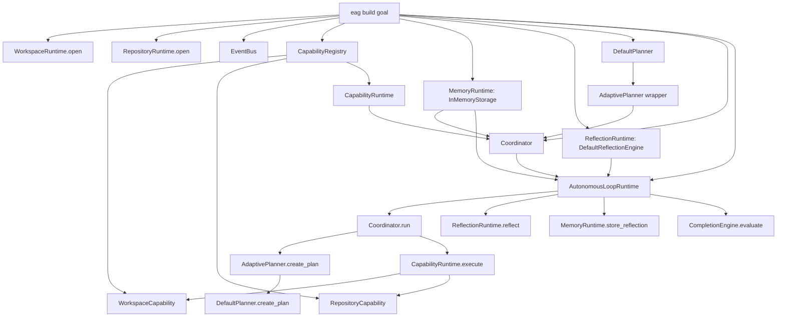

# EAG G2.0 — Reality & Contract Stabilization Report

**Audit date:** 20 August 2026

**Current baseline:** `main` at `1868e5c9a1d1d258d17ec993c437dfcba5401bd6` — `chore: ignore generated workspace artifacts` (5 August 2026)

**Scope:** Non-invasive audit and implementation planning only. This report does **not** implement G2.0, introduce an LLM, redesign Gen2, add a UI, add workers, remove Gen1 subsystems, commit, push, or tag.

> **Evidence convention.** **FACT** is verified directly from the current repository, executed quality commands, and reproduced failures. **INFERENCE** is a conclusion from that evidence. **RECOMMENDATION** is a proposed future change, not an implementation.

---

## 1. Current Git State

**FACT.** The repository is on `main`, tracking `origin/main`, at commit `1868e5c9a1d1d258d17ec993c437dfcba5401bd6`. There are no commits after the Gen2 readiness-report baseline. `HEAD` is one commit after tag `v1.0.0`; `git describe` returns `v1.0.0-1-g1868e5c`. [1]

**FACT.** The previous `EAG_GENERATION_2_READINESS_REPORT.md` exists locally but is untracked and has not been committed. This audit report is likewise a requested report artifact only; no implementation source, test, configuration, documentation baseline, commit, tag, or remote state has been changed by the audit.

| Item | Current state |
|---|---|
| Branch | `main...origin/main` |
| HEAD | `1868e5c9a1d1d258d17ec993c437dfcba5401bd6` |
| HEAD subject | `chore: ignore generated workspace artifacts` |
| Commits since readiness baseline | `0` |
| Tag at HEAD | None; nearest description is `v1.0.0-1-g1868e5c` |
| Readiness report committed | No — untracked local artifact |
| Implementation commits/pushes/tags during this audit | None |

---

## 2. Current Test and Quality Baseline

### 2.1 Commands run

**FACT.** The contribution guide declares `pytest`, `ruff check .`, `mypy .`, and an optional documented coverage variant as quality commands. The commands below were executed through the project’s locked `uv` environment. [2]

| Command | Result | Recorded baseline |
|---|---|---|
| `uv run pytest -q` | Failed | **3342 passed, 8 failed, 1 skipped, 62 errors** in **29.63s** |
| `uv run pytest --cov=eag --cov-report=term-missing -q --tb=no` | Failed | Same behavioral result in **34.22s**; aggregate coverage **86%** |
| `uv run ruff check .` | Failed | **18 errors**, of which **6 are automatically fixable** |
| `uv run mypy .` | Failed | **1382 errors in 77 files** across source and tests |
| `uv run mypy src/eag` | Failed | **9 source errors in 5 files** |

### 2.2 Test-failure classification

| Failure group | Current result | Root cause | G2.0 disposition |
|---|---|---|---|
| Autonomous-loop setup errors | 62 errors | Tests instantiate `AutonomousLoopRuntime` with `chief_runtime=` and `capability_runtime=`, while production now requires `coordinator=`. Fixtures then bypass public contracts with private Chief/Coordinator attributes. [3] [4] | **In scope.** Stabilize one public construction contract and migrate fixtures. |
| EBS-010 / EBS-011 / EBS-012 | 5 failures | The same stale `AutonomousLoopRuntime` constructor contract is used by the benchmark tests. [5] [6] [7] | **In scope.** Update the shared construction path; do not redesign the benchmarks. |
| Git diff tests | 2 failures | ANSI escapes split expected `+`/`-` diff lines when ambient Git colour is forced. [8] [9] | **In scope.** Disable colour at the Git command boundary. |
| Repository branch test | 1 failure | ANSI escape sequences remain in `GitProvider.list_branches()` output because the provider passes through forced-colour output and only strips `*`/whitespace. [10] [11] | **In scope.** Disable colour at the provider command boundary. |
| Ruff | 18 findings | Existing formatting/import/unused-import findings, including EBS test modules. [2] | **Not a separate G2.0 feature.** Fix only findings in files touched by G2.0; record any unrelated inherited debt. |
| MyPy source scope | 9 errors in 5 source files | Existing annotations/errors in adaptive, worker, and autonomous modules. Five errors occur in `autonomous/runtime.py`, a planned G2.0 touch point. [12] | **Partly in scope.** Resolve errors in touched G2.0 source files; do not expand this stabilization into a repository-wide typing campaign without approval. |
| MyPy repository scope | 1382 errors in 77 files | The documented `mypy .` command analyzes the test suite and uncovers broad inherited strict-typing debt. | **Out of minimal scope.** Capture as an explicit release-quality debt; do not conflate it with the autonomous composition repair. |

**INFERENCE.** The baseline confirms the readiness report’s conclusion: the most important failure is a **composition-contract regression**, not a missing capability. A focused G2.0 repair can make the autonomous route truthful and green without importing any Gen2.1 LLM, UI, worker, or benchmark-reform scope.

---

## 3. Actual Runtime Composition Graph

### 3.1 Current `eag build` path

**FACT.** `eag build` is currently the only production composition root that constructs an autonomous loop. It creates an event bus; opens workspace and repository runtimes; registers workspace and repository capabilities; creates in-memory memory and deterministic reflection; constructs `DefaultPlanner`, wraps it in `AdaptivePlanner`, creates `Coordinator`, and passes that Coordinator directly to `AutonomousLoopRuntime`. [13]



**FACT.** `ChiefRuntime` is **not constructed** anywhere on this `eag build` path. The current CLI path therefore bypasses the intended relationship in which the Chief owns the Coordinator. [13] [14]

**FACT.** `AdaptivePlanner` is injected as the Coordinator’s ordinary `planner`, but the Coordinator’s separate `adaptive_planner` argument is not supplied. Consequently, `Coordinator.run()` invokes only `AdaptivePlanner.create_plan()`, which delegates to `DefaultPlanner.create_plan()`. Its adaptive `plan()` method cannot run in the CLI composition even when memory exists. [13] [15] [16]

### 3.2 Autonomous-loop execution path

**FACT.** The current loop contract accepts a `Coordinator`, reflection runtime, memory runtime, optional completion/recovery/approval components, and an optional event bus. Each iteration directly calls `Coordinator.run()`, reflects the resulting run, stores memory, evaluates completion, and optionally evaluates recovery or approval. [4]

```text
AutonomousLoopRuntime.execute(LoopContext)
  → direct assignment: Coordinator._memory = loop memory
  → Coordinator.run(RunContext)
      → planner.create_plan()
      → CapabilityRuntime.execute(request, context) for each scheduled step
      → DefaultValidator.validate(...)
      → RunResult
  → ReflectionRuntime.reflect(ReflectionContext)
  → MemoryRuntime.store_reflection(...)
  → CompletionEngine.evaluate(run, reflection, iteration, max_iterations)
  → optional RecoveryEngine.evaluate(...) or ApprovalRuntime.request_approval(...)
  → LoopResult
```

**FACT.** The direct `Coordinator._memory` assignment is production private dependency injection. The loop also contains debug `print()` calls and has five current MyPy errors related to optional planning-decision and approval identifiers. [4] [12]

### 3.3 Chief and Coordinator paths outside `eag build`

**FACT.** `ChiefRuntime.execute_goal()` has a different composition model: it retrieves planner and validator objects from `RuntimeRegistry`, requires a `CapabilityRuntime` per call, and constructs a fresh `Coordinator` internally. It accepts neither memory nor adaptive planner nor a prebuilt Coordinator through its public API. [14]

**FACT.** `ChiefBenchmarkExecutor` constructs a separate synthetic Chief path with a local mock planner and permissive mock capability. The CLI benchmark command contains another inline construction path. Neither is suitable as the G2.0 canonical autonomous-engineering composition root. [17] [13]

**FACT.** Worker and scheduler subsystems remain separate. `SchedulerRuntime` depends on a `WorkerManager` and `WorkerRuntime`, and is not constructed by `eag build`; its “parallel” batch execution is currently sequential internally. These subsystems should remain untouched in G2.0. [18]

---

## 4. Contract Map

| Boundary | Current public constructor / interface | Owner and lifecycle | Inputs → outputs | Current implementation and tests | Mismatch |
|---|---|---|---|---|---|
| **ChiefRuntime → Coordinator** | `ChiefRuntime(registry, event_bus)`; `execute_goal(context, capability_runtime, ...)` | Chief creates a fresh Coordinator per `execute_goal()` invocation. | `RunContext` + caller capability runtime → `RunResult`. | Covered by `test_chief_runtime.py` using per-call capability injection. [14] [19] | CLI autonomous build bypasses Chief entirely. Chief has no public way to own a long-lived Coordinator configured with memory/adaptive planning. |
| **Coordinator → Planner** | `Coordinator(planner, capability_runtime, validator, scheduler?, event_bus?, memory_runtime?, adaptive_planner?)` | Coordinator owns planning/execution of one run. | `RunContext` → `Plan` / `RunResult`. | Base planner is mandatory; optional adaptive path executes only when both memory and a separate adaptive planner are supplied. [16] | CLI supplies `AdaptivePlanner` in the base-planner slot but omits `adaptive_planner`, disabling actual adaptation. Planner/validator are untyped constructor parameters. |
| **Coordinator → CapabilityRuntime** | `CapabilityRuntime(registry?)`; `execute(request, context)` | Coordinator builds request/context and dispatches sequentially. | `CapabilityRequest` + `CapabilityContext` → `CapabilityResult` / `StepResult`. | Thin, real capability dispatcher; strong existing Chief integration coverage. [16] [20] | No direct mismatch in this boundary. The mismatch is ownership: Chief reconstructs a Coordinator rather than retaining canonical composition. |
| **Coordinator → MemoryRuntime** | Optional `memory_runtime` constructor argument. | Coordinator may query memory before plan adaptation. | Goal text → optional engineering experience → planning decision. | Directly public injection exists. [16] | Loop redundantly overwrites private `Coordinator._memory` each run because ownership is not established once at composition time. |
| **AutonomousLoopRuntime → Chief/Coordinator** | Actual: `AutonomousLoopRuntime(coordinator, reflection_runtime, memory_runtime, ...)`. Legacy tests: `AutonomousLoopRuntime(chief_runtime, reflection_runtime, memory_runtime, capability_runtime, ...)`. | Loop owns iterations, reflection, memory store, completion/recovery/approval. | `LoopContext` → `LoopResult`. | CLI follows current Coordinator signature; 62 erroring tests and EBS-010/011/012 follow stale Chief signature. [4] [5] [6] [7] [13] | The public constructor has drifted. Tests know former private Chief internals to compensate. |
| **Loop → ReflectionRuntime** | `ReflectionRuntime(engine, event_bus)`; `reflect(context)` | Loop calls it after each Coordinator result. | `ReflectionContext` → `ReflectionReport`. | Public, event-producing wrapper. [21] | No constructor mismatch. It is absent from Chief ownership, so Chief-only runs do not reflect. |
| **Loop → MemoryRuntime** | `MemoryRuntime(storage, event_bus)`; `store_reflection` / `get_relevant_experience` | Loop stores after each reflection. | Reflection context/report → memory entry. | CLI uses `InMemoryStorage`. [13] [22] | Memory has two owners conceptually: loop storage and Coordinator adaptation. Private injection masks that gap. |
| **Loop → Completion / Recovery / Approval** | Optional constructor collaborators, defaulted internally. | Loop owns terminal outcome and pause/abort decisions. | Run/reflection/iteration → decision/action/loop result. | Existing autonomous tests cover behaviors but mutate private loop collaborators heavily. [3] [4] | Tests should inject collaborators through public construction rather than assigning `_completion`, `_chief`, `_memory`, or `_reflection` after construction. |
| **Review / verification** | `ReviewRuntime(registry, event_bus)` exists independently. | No owner in the CLI autonomous loop. | `ReviewContext` → `ReviewReport`. | Constructed in the benchmark CLI setup, not `eag build`. [13] | **Known but intentionally deferred.** G2.0 must document this absence, not integrate review or redesign completion. |
| **WorkerRuntime / SchedulerRuntime** | Worker/scheduler constructors require worker registry/manager/task graph collaborators. | Separate scheduler platform. | Task graph + worker context → completed/failed sets. | Not constructed in CLI autonomous path. [18] | **Intentionally out of scope.** No worker integration belongs in G2.0. |

---

## 5. Composition Roots and Private Dependency Injection

### 5.1 Production composition sites

**FACT.** Core runtimes are manually assembled in the following production sites. [13] [14] [17]

| Site | Purpose | G2.0 treatment |
|---|---|---|
| `src/eag/cli.py:build` | Direct autonomous build assembly. | **Replace as the assembly owner.** Delegate to canonical factory/composition root. |
| `src/eag/chief/runtime/runtime.py:execute_goal` | Per-call Chief/Coordinator construction. | **Preserve legacy behavior** for existing direct Chief and benchmark use, while adding a public precomposed Coordinator path. |
| `src/eag/cli.py:benchmark` | Inline benchmark-specific runtime assembly. | **Do not modify** unless contract compatibility requires a minimal adjustment. It is not the canonical production path. |
| `src/eag/benchmark/chief_executor.py` | Mock benchmark Chief assembly. | **Do not modify.** It is intentionally simulation infrastructure. |
| `src/eag/bootstrap.py` | Kernel/plugin composition. | **Do not modify.** It is not an autonomous-build composition root. |
| Worker/scheduler modules | Worker/task-graph assembly occurs outside the autonomous build route. | **Do not modify.** |

### 5.2 Private injection audit

**FACT.** Production code assigns `self._coordinator._memory = self._memory` in every autonomous execution. Tests make 84 direct accesses to loop/Chief/Coordinator private fields across five autonomous-related files; `test_autonomous_loop.py` alone makes 54. These accesses include `_chief`, `_coordinator`, `_coordinator_memory`, `_coordinator_capability`, `_completion`, `_reflection`, and `_memory`. [3] [4]

**INFERENCE.** The test failures are not simply a constructor-renaming issue. They reveal that there is no authoritative public composition contract. Tests recreate missing lifecycle relationships through undocumented private fields, so any internal refactor becomes a large test break.

---

## 6. Root Cause of Each Current Failure

### 6.1 Autonomous-loop errors and EBS failures

**FACT.** The production `AutonomousLoopRuntime.__init__` requires `coordinator`. The central autonomous test fixture, recovery/approval fixture, and EBS-010/011/012 tests pass `chief_runtime=` and `capability_runtime=` instead. Python fails before any behavioral assertion can execute. [3] [4] [5] [6] [7]

**Root cause:** A prior internal design change moved the loop from Chief-driven execution to Coordinator-driven execution, but no public migration path or shared factory was introduced. CLI code was updated independently; fixtures and benchmark tests were not.

### 6.2 Git ANSI/colour failures

**FACT.** The audit environment reports `color.ui always` with origin `command line`. Targeted `test_git_diff` reproduces a patch in which ANSI sequences split `+` from `# Changed`, making the required plain substring absent. [8]

**FACT.** Both `GitTool._run()` and `GitProvider._run()` invoke `git` without an explicit colour policy. `GitProvider.list_branches()` attempts only `strip().replace("*", "")`, which cannot normalize ANSI control sequences. [9] [11]

**Root cause:** Production Git adapters inherit ambient Git colour configuration into machine-parsed output. This is an output-normalization defect in the adapters, not an incorrect test expectation.

### 6.3 Quality-gate failures

**FACT.** Ruff and MyPy failures predate implementation work in this task. Narrow source MyPy shows five errors in `autonomous/runtime.py`, but the repository-wide `mypy .` baseline is much larger because strict test analysis produces 1382 errors. [12]

**INFERENCE.** G2.0 should not claim a clean global quality gate unless the scope is explicitly widened. Its narrow quality goal should be: no newly introduced diagnostics, no diagnostics in the G2.0 touched source modules, and an explicit inherited-debt record for the wider baseline.

---

## 7. Proposed Canonical Composition Root

### 7.1 Recommendation

**RECOMMENDATION.** Add a single explicit factory in the autonomous package, tentatively named:

```python
create_autonomous_engineering_composition(workspace_root: Path, *, event_bus: EventBus | None = None)
    -> AutonomousEngineeringComposition
```

`AutonomousEngineeringComposition` should be a small immutable public container exposing the loop and the intentionally composed runtime collaborators required for G2.0 inspection/tests: `loop`, `chief`, `coordinator`, `capability_runtime`, `memory_runtime`, and `reflection_runtime`. It is not a new Gen2 application architecture; it is a transparent factory boundary for the existing Gen1 components.

The factory should construct exactly the current CLI’s supported deterministic components:

```text
EventBus
  → WorkspaceRuntime + RepositoryRuntime
  → WorkspaceCapability + RepositoryCapability
  → CapabilityRegistry + CapabilityRuntime
  → DefaultPlanner + AdaptivePlanner
  → DefaultValidator + Coordinator(memory_runtime, adaptive_planner)
  → ChiefRuntime(coordinator)
  → ReflectionRuntime + MemoryRuntime(InMemoryStorage)
  → AutonomousLoopRuntime(chief_runtime, reflection_runtime, memory_runtime)
```

**RECOMMENDATION.** The factory must supply `DefaultPlanner` as the Coordinator’s base planner and `AdaptivePlanner(base_planner=base_planner)` as the Coordinator’s separate `adaptive_planner` collaborator. This preserves first-run deterministic planning and enables the already implemented adaptive branch only when relevant memory is present. It corrects a demonstrable CLI composition bug without adding new behavior categories.

### 7.2 Stable public contracts

**RECOMMENDATION.** Establish the following ownership contract.

| Component | Stable G2.0 public contract | Ownership rule |
|---|---|---|
| `Coordinator` | Retain its existing public constructor, with `memory_runtime` and `adaptive_planner` supplied at construction. | Coordinator owns plan/execution orchestration and is configured once. |
| `ChiefRuntime` | Add an optional public precomposed `coordinator` constructor argument. When supplied, `execute_goal(context)` delegates to that instance. Retain the existing registry plus per-call `capability_runtime` path for compatibility. | Chief owns the Coordinator for canonical autonomous runs. |
| `AutonomousLoopRuntime` | Change the public constructor to accept `chief_runtime`, reflection runtime, memory runtime, optional completion/recovery/approval, and event bus. Remove `capability_runtime` from loop construction. | Loop owns iteration, reflection, memory persistence, and completion; it never writes Chief/Coordinator private state. |
| Canonical factory | Build the components above and return a transparent composition container. | CLI and canonical acceptance tests use this one path. |

**RECOMMENDATION.** `ChiefRuntime.execute_goal()` should remain backward compatible when no precomposed Coordinator is supplied: it may continue to construct a transient Coordinator from its registry and supplied `CapabilityRuntime`. That protects direct Chief tests and benchmark-simulation code. When a precomposed Coordinator exists, an additional `capability_runtime` argument should be rejected or ignored by a clearly documented policy to avoid two conflicting execution owners.

### 7.3 Why this is the smallest coherent fix

**INFERENCE.** This approach changes only ownership and construction contracts. It does not introduce LLM reasoning, model routing, review integration, worker dispatch, benchmark redesign, a UI, persistence redesign, or new business capabilities. It uses the existing `Coordinator`, `CapabilityRuntime`, `MemoryRuntime`, `ReflectionRuntime`, `DefaultPlanner`, `AdaptivePlanner`, `WorkspaceCapability`, and `RepositoryCapability` rather than replacing them.

---

## 8. Minimal G2.0 Change List

| Priority | Proposed change | Reason | Scope guard |
|---|---|---|---|
| 1 | Add canonical autonomous composition factory/container. | Make CLI and tests use one visible, deterministic assembly path. | No LLM, workers, review, UI, or benchmark redesign. |
| 2 | Extend `ChiefRuntime` with public precomposed-Coordinator support while retaining legacy registry/per-call capability execution. | Restore Chief → Coordinator ownership in the canonical path without breaking existing callers. | No Chief intelligence/model changes. |
| 3 | Restore `AutonomousLoopRuntime` public Chief-driven construction and call `ChiefRuntime.execute_goal()` per iteration. | Align constructor with intended architecture and eliminate stale test mismatch. | Loop remains deterministic; no new execution capabilities. |
| 4 | Remove loop-side private Coordinator memory assignment. | Coordinator receives memory publicly from the factory. | No memory-storage redesign. |
| 5 | Correct the CLI build command to invoke the factory. | Ensure user-facing build and canonical tests exercise the same route. | Preserve workspace cleanup, generated templates, output, and max-iteration behavior. |
| 6 | Make Git adapters force colour-free, pager-free machine output. | Remove ambient terminal/config dependency from all parsed Git output. | Do not change Git domain models or behavior beyond output normalization. |
| 7 | Update stale autonomous/EBS fixtures to use factory/public constructors and public fakes. | Remove fixture knowledge of private coordinator internals. | Preserve existing behavioral assertions; do not replace them with weaker tests. |
| 8 | Resolve G2.0-touched source typing defects in `autonomous/runtime.py`. | The module will be touched and currently contains nullability errors. | Do not turn G2.0 into global MyPy cleanup. |

---

## 9. Proposed Test Changes

### 9.1 Required proof tests

| Required proof | Proposed test | Existing test disposition |
|---|---|---|
| 1. Canonical composition | A factory test asserts the factory returns a loop, Chief, Coordinator, capability runtime, memory runtime, and reflection runtime on one shared event bus. | **New focused test** in `tests/test_autonomous_composition.py`. |
| 2. Loop construction contract | Construct loop with public `ChiefRuntime`, reflection, memory, and optional policy collaborators; assert invalid/missing core collaborators fail predictably. | **Update** `test_autonomous_loop.py` fixture; do not keep old `chief_runtime`/`capability_runtime` constructor usage. |
| 3. Chief → Coordinator | Supply a public precomposed Coordinator to Chief, execute a simple plan, and assert the bound Coordinator is used. | **Extend** `test_chief_runtime.py`; retain legacy per-call capability coverage. |
| 4. Coordinator → CapabilityRuntime | Execute a two-step public coordinator plan through registered capabilities and verify results/events. | **Retain and tighten** existing `TestCoordinatorAndRuntime` tests. |
| 5. Reflection integration | Execute one canonical loop iteration and assert reflection entry/report/event evidence. | **Update** autonomous-loop fixture assertions; no private runtime replacement. |
| 6. Memory integration | Execute canonical loop with in-memory storage and assert stored reflection is retrievable through the composition’s public memory member. | **Update** existing autonomous-memory test and `test_chief_integration_loops.py` as needed. |
| 7. Completion/recovery | Inject `CompletionEngine`, `RecoveryEngine`, and `ApprovalRuntime` through the public loop constructor; assert stop, retry, approval pause/resume paths. | **Update** `test_autonomous_recovery_approval.py`; replace private collaborator mutation. |
| 8. CLI build composition | Invoke the CLI build command in a disposable workspace and prove it calls the canonical factory/path, produces the existing deterministic artifact, and returns a loop result. | **New focused CLI composition test**; preserve existing generated-output behavior. |
| 9. ANSI-independent Git output | Set repository-local `color.ui=always`, then assert `GitTool.diff()` has no escape codes and `GitProvider.list_branches()` returns clean names. | **Extend** `tests/test_git.py` and `tests/test_repository_platform.py`; retain existing plain-output tests. |
| 10. Disposable-workspace acceptance | Run the canonical factory and `LoopContext(goal="Build a calculator")` in a temporary workspace; assert a clean Git repository, expected generated files, one stored reflection, and terminal loop result. | **New acceptance test** using only the canonical factory. |

### 9.2 Existing tests that should be updated, not duplicated

| Existing file | Required update |
|---|---|
| `tests/test_autonomous_loop.py` | Replace stale fixture construction and private Chief/loop substitutions with factory/public constructor and explicit fake collaborators. Preserve model, iteration, event, memory, reflection, and completion assertions. |
| `tests/test_autonomous_recovery_approval.py` | Replace private `_coordinator`, `_coordinator_memory`, `_coordinator_capability`, `_chief`, and loop collaborator assignments with the canonical composition and public injected policies. |
| `tests/test_ebs_010_autonomous_loop.py` | Replace stale loop signature and private Chief dependency wiring. Keep benchmark assertions unchanged unless the test asserts obsolete API details. |
| `tests/test_ebs_011_convergence.py` | Replace stale loop signature/private injection while preserving convergence assertions. |
| `tests/test_ebs_012_multi_goal.py` | Replace stale loop signature/private injection while preserving multi-goal memory assertions. |
| `tests/test_chief_runtime.py` | Add bound-Coordinator coverage while retaining current registry/per-call capability compatibility tests. |
| `tests/test_git.py` | Retain diff/branch assertions and add forced-colour regression coverage. |
| `tests/test_repository_platform.py` | Retain branch behavior assertions and force repository-local colour configuration in one regression test. |

---

## 10. Files That Would Be Modified

### 10.1 Production files

| File | Proposed modification |
|---|---|
| `src/eag/autonomous/factory.py` | **New.** Canonical autonomous composition factory and small public composition container. |
| `src/eag/autonomous/__init__.py` | Export the canonical factory/container. |
| `src/eag/autonomous/runtime.py` | Stabilize public Chief-driven loop constructor; remove private Coordinator memory assignment; resolve touched nullability diagnostics without changing policy behavior. |
| `src/eag/chief/runtime/runtime.py` | Support public precomposed Coordinator ownership while preserving existing registry/per-call capability path. |
| `src/eag/cli.py` | Replace inline `build` runtime assembly with canonical factory use only. |
| `src/eag/plugins/builtin/git/tool.py` | Invoke Git with explicit no-colour/no-pager machine-output settings. |
| `src/eag/vcs/providers/git.py` | Invoke Git with explicit no-colour/no-pager machine-output settings before parsing branch/status/history output. |

### 10.2 Test files

| File | Proposed modification |
|---|---|
| `tests/test_autonomous_composition.py` | **New.** Canonical composition, CLI-equivalent, and disposable-workspace acceptance coverage. |
| `tests/test_autonomous_loop.py` | Migrate stale constructor fixture and private-field test control to public contracts. |
| `tests/test_autonomous_recovery_approval.py` | Migrate stale fixture/private injection to public contracts. |
| `tests/test_ebs_010_autonomous_loop.py` | Migrate loop construction contract. |
| `tests/test_ebs_011_convergence.py` | Migrate loop construction contract. |
| `tests/test_ebs_012_multi_goal.py` | Migrate loop construction contract. |
| `tests/test_chief_runtime.py` | Add public precomposed Coordinator coverage; retain legacy Chief coverage. |
| `tests/test_git.py` | Add forced-colour diff regression test. |
| `tests/test_repository_platform.py` | Add forced-colour branch-list regression test. |

---

## 11. Files That Should **Not** Be Modified in G2.0

**RECOMMENDATION.** The following areas should remain frozen unless an unexpected direct contract dependency emerges during approved implementation.

| Area | Why it is excluded |
|---|---|
| `src/eag/chief/intelligence/**` and LiteLLM/provider modules | G2.1 scope; no LLM integration is authorized. |
| `src/eag/workers/**`, `src/eag/scheduler/**`, `src/eag/task_graph/**` | Worker/multi-agent behavior is explicitly out of scope. |
| `src/eag/review/**` | Review remains a documented absent boundary; integrating it would expand scope. |
| `src/eag/benchmark/templates.py`, evaluator/reporter, benchmark semantics | Benchmark redesign is explicitly deferred. Only stale autonomous test construction changes are allowed. |
| `src/eag/source/**`, `src/eag/index/**`, `src/eag/graph/**` | No source-intelligence integration work is required to stabilize contracts. |
| `src/eag/bootstrap.py` | Default kernel boot is not the autonomous build composition path. |
| Memory storage design | Durable memory is not G2.0 scope; retain `InMemoryStorage`. |
| Planning template content | Preserve Generation 1 deterministic behavior. |

---

## 12. Risks and Regression Controls

| Risk | Regression control |
|---|---|
| Binding a Coordinator to Chief changes direct-Chief behavior. | Preserve current fallback path when no Coordinator is provided; retain all existing per-call `CapabilityRuntime` tests. |
| Loop constructor migration breaks hidden callers. | Treat Chief-driven loop constructor as the explicit supported contract; migrate all in-repository callers in one change set and document it in the changelog/release note if approved. |
| Factory becomes a second opaque runtime architecture. | Keep the factory small, transparent, deterministic, and limited to existing Gen1 collaborators; expose the assembled collaborators in a simple public container. |
| Adaptive planning changes visible build behavior. | First run remains unchanged because memory is empty. Add regression tests for the existing generic/known-goal artifact path and only enable already implemented adaptation when memory is available. |
| Git `--no-color` changes human-oriented CLI output. | Apply it only inside programmatic adapter subprocess calls; CLI rendering remains responsible for presentation. |
| Existing large private-field test suite becomes difficult to migrate. | Preserve behavioral test intent, but convert fixtures first and replace only private test doubles with public collaborator fakes. Avoid deleting coverage to gain green status. |
| Broad Ruff/MyPy debt delays G2.0. | Require zero new diagnostics and resolve touched-file diagnostics; record repository-wide debt as a separate follow-up rather than mixing it into contract stabilization. |

---

## 13. Estimated Implementation Sequence

> This is a proposed sequence only. Implementation must not begin until explicit approval.

| Step | Work item | Expected proof before moving on |
|---|---|---|
| 1 | Add failing/explicit contract tests for canonical composition and forced-colour Git behavior. | Tests fail for the intended reasons against current code. |
| 2 | Add composition factory/container and public precomposed Coordinator support in Chief. | Chief → Coordinator and factory tests pass; legacy direct-Chief tests remain valid. |
| 3 | Move autonomous loop to Chief-driven public construction and remove private Coordinator memory assignment. | Autonomous construction contract and memory/adaptive ownership tests pass. |
| 4 | Replace CLI `build` inline assembly with factory use. | Disposable-workspace CLI composition test and existing build behavior pass. |
| 5 | Migrate autonomous and EBS tests away from private construction/injection. | 62 errors and five contract-related benchmark failures are eliminated without reducing behavioral coverage. |
| 6 | Apply Git no-colour/no-pager boundaries in both adapters. | Diff and branch tests pass under `color.ui=always`; output contains no ANSI escape sequences. |
| 7 | Resolve touched-file typing/lint findings, run regression suite, and classify remaining inherited global debt. | Full suite passes; G2.0 touched-file Ruff/MyPy checks pass; final report records residual out-of-scope debt if any. |

---

## 14. G2.0 Readiness Decision

**FACT.** The current repository is unchanged from the readiness-report commit except for untracked requested report artifacts. The current test failures are reproducible and have bounded, evidence-based root causes.

**INFERENCE.** G2.0 is ready for implementation once the proposed contract is approved. The work is narrowly scoped, has a clear canonical composition target, preserves Gen1 systems, and does not depend on Gen2.1 decisions.

**RECOMMENDATION.** Approve G2.0 as the planned minimal stabilization package above. Do not approve any LLM, UI, worker, review-integration, benchmark-reform, memory-persistence, or architecture-redesign work until this composition contract and its tests are green.

```text
G2.0_RECON_COMPLETE=YES
G2.0_IMPLEMENTATION_READY=YES
FILES_MODIFIED=0
COMMIT=NOT_PERFORMED
PUSH=NOT_PERFORMED
```

---

## References

[1]: https://github.com/MenaYassa/EAG/commit/1868e5c9a1d1d258d17ec993c437dfcba5401bd6 "Current assessed commit"
[2]: https://github.com/MenaYassa/EAG/blob/1868e5c9a1d1d258d17ec993c437dfcba5401bd6/docs/CONTRIBUTING.md "Documented contribution quality gates"
[3]: https://github.com/MenaYassa/EAG/blob/1868e5c9a1d1d258d17ec993c437dfcba5401bd6/tests/test_autonomous_loop.py "Autonomous-loop fixture and private access"
[4]: https://github.com/MenaYassa/EAG/blob/1868e5c9a1d1d258d17ec993c437dfcba5401bd6/src/eag/autonomous/runtime.py "Current autonomous-loop constructor and execution flow"
[5]: https://github.com/MenaYassa/EAG/blob/1868e5c9a1d1d258d17ec993c437dfcba5401bd6/tests/test_ebs_010_autonomous_loop.py "EBS-010 autonomous-loop test"
[6]: https://github.com/MenaYassa/EAG/blob/1868e5c9a1d1d258d17ec993c437dfcba5401bd6/tests/test_ebs_011_convergence.py "EBS-011 convergence test"
[7]: https://github.com/MenaYassa/EAG/blob/1868e5c9a1d1d258d17ec993c437dfcba5401bd6/tests/test_ebs_012_multi_goal.py "EBS-012 multi-goal memory test"
[8]: https://github.com/MenaYassa/EAG/blob/1868e5c9a1d1d258d17ec993c437dfcba5401bd6/tests/test_git.py "Git diff expectations"
[9]: https://github.com/MenaYassa/EAG/blob/1868e5c9a1d1d258d17ec993c437dfcba5401bd6/src/eag/plugins/builtin/git/tool.py "GitTool subprocess adapter"
[10]: https://github.com/MenaYassa/EAG/blob/1868e5c9a1d1d258d17ec993c437dfcba5401bd6/tests/test_repository_platform.py "Repository branch expectations"
[11]: https://github.com/MenaYassa/EAG/blob/1868e5c9a1d1d258d17ec993c437dfcba5401bd6/src/eag/vcs/providers/git.py "GitProvider subprocess adapter"
[12]: https://github.com/MenaYassa/EAG/blob/1868e5c9a1d1d258d17ec993c437dfcba5401bd6/pyproject.toml "MyPy and Ruff configuration"
[13]: https://github.com/MenaYassa/EAG/blob/1868e5c9a1d1d258d17ec993c437dfcba5401bd6/src/eag/cli.py "CLI build and benchmark composition paths"
[14]: https://github.com/MenaYassa/EAG/blob/1868e5c9a1d1d258d17ec993c437dfcba5401bd6/src/eag/chief/runtime/runtime.py "Chief runtime composition path"
[15]: https://github.com/MenaYassa/EAG/blob/1868e5c9a1d1d258d17ec993c437dfcba5401bd6/src/eag/adaptive/planner.py "Adaptive planner public behavior"
[16]: https://github.com/MenaYassa/EAG/blob/1868e5c9a1d1d258d17ec993c437dfcba5401bd6/src/eag/chief/runtime/coordinator.py "Coordinator execution and optional adaptive/memory dependencies"
[17]: https://github.com/MenaYassa/EAG/blob/1868e5c9a1d1d258d17ec993c437dfcba5401bd6/src/eag/benchmark/chief_executor.py "Synthetic benchmark Chief composition"
[18]: https://github.com/MenaYassa/EAG/blob/1868e5c9a1d1d258d17ec993c437dfcba5401bd6/src/eag/scheduler/runtime.py "Worker scheduler runtime"
[19]: https://github.com/MenaYassa/EAG/blob/1868e5c9a1d1d258d17ec993c437dfcba5401bd6/tests/test_chief_runtime.py "Chief and Coordinator contract tests"
[20]: https://github.com/MenaYassa/EAG/blob/1868e5c9a1d1d258d17ec993c437dfcba5401bd6/src/eag/capability/runtime.py "Capability dispatch runtime"
[21]: https://github.com/MenaYassa/EAG/blob/1868e5c9a1d1d258d17ec993c437dfcba5401bd6/src/eag/reflection/runtime.py "Reflection runtime contract"
[22]: https://github.com/MenaYassa/EAG/blob/1868e5c9a1d1d258d17ec993c437dfcba5401bd6/src/eag/memory/runtime.py "Memory runtime contract"
