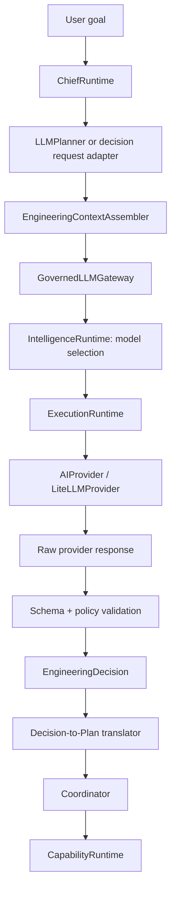

# G2.1 Governed LLM Gateway Design

**Design date:** 20 August 2026
**Design baseline:** [`v2.0.0-g2.0`](https://github.com/MenaYassa/EAG/tree/v2.0.0-g2.0) / commit `8ce2ba953854995ed179ac55a1c049dd4bae0f33`
**Status:** **Design only — implementation not started**

> **Scope boundary.** This document defines the first G2.1 milestone: a governed LLM gateway that produces **validated, structured engineering decisions**. It does not authorize direct LLM execution of capabilities, code changes, a chat UI, a frontend, worker/scheduler redesign, persistent-memory work, planner replacement, or any other G2.1 implementation.

> **Evidence convention.** **FACT** is verified in the G2.0-tagged repository. **INFERENCE** is a conclusion from that evidence. **RECOMMENDATION** is a proposed G2.1 design, not an implemented change.

---

## 1. Objective

**RECOMMENDATION.** The first G2.1 release should make the following controlled transition:

```text
User goal
  → Chief
  → Engineering-context assembly
  → Governed LLM Gateway
  → Structured EngineeringDecision
  → Schema and policy validation
  → Planner / Chief
```

The milestone’s narrow success condition is that a real, routed provider can return a schema-valid `EngineeringDecision` containing an interpreted goal, assumptions, an approach, an ordered plan, required capabilities, risks, and confidence. The decision is an **advisory domain artifact**, not an authorization to execute any operation.

**FACT.** G2.0 established a canonical deterministic build path in which a composition factory creates the event bus, capabilities, memory, reflection, planners, Coordinator, Chief, and autonomous loop. The CLI build command uses that factory, and Chief may publicly own a precomposed Coordinator. [1] [2]

**INFERENCE.** This stabilized composition is the correct control plane for introducing a bounded reasoning dependency. The new gateway should be injected into that composition later, rather than being created ad hoc by the CLI, a planner, or a capability.

---

## 2. Current LLM Infrastructure

| Area | FACT | G2.1 implication |
|---|---|---|
| Model selection | `IntelligenceRuntime` accepts an `ExecutionRequest`, publishes selection events, and returns an explainable `SelectionDecision` containing a model, provider, confidence, alternatives, match result, and score breakdown. [3] [4] | Reuse it as the routing sub-step; do not make routing itself the gateway contract. |
| Provider transport | The execution layer defines a provider-neutral `AIProvider` protocol around `ExecutionContext` and `ExecutionResult`, including health, discovery, model listing, streaming, and support checks. [5] | Keep provider transport below the new domain gateway. |
| Provider execution | `ExecutionRuntime` already coordinates provider registry lookup, health checks, retry, ordered fallback, trace events, usage collection, and pricing estimates. [6] | Reuse or adapt it for transport resiliency; the gateway remains responsible for decision-level policy and validation. |
| LiteLLM adapter | `LiteLLMProvider` sends a single user prompt to `litellm.completion()`, returns text and token usage, and can attach optional key/base settings. It currently has no structured-output request contract, tool-call loop, or domain-decision validation. [7] | LiteLLM must remain an adapter implementation, never the source of domain truth. |
| Existing tests | Provider and execution tests mainly mock `litellm.completion()`. A real integration test is skipped unless separate test credentials and base URL are present. [8] | G2.1 needs a deliberately configured, real-provider benchmark rather than another hardcoded response test. |
| Planner seam | `DefaultPlanner.create_plan(RunContext) -> Plan` is deterministic and template-based. `AdaptivePlanner` delegates base plan generation through the same `create_plan` method before applying deterministic rules. [9] [10] | A future `LLMPlanner` can preserve this input/output seam but must obtain a validated decision through the gateway before a deterministic plan translation. |

---

## 3. Current Integration Gaps

**FACT.** The G2.0 canonical factory deliberately assembles only deterministic planning and execution components. It does not construct `IntelligenceRuntime`, `ExecutionRuntime`, or `LiteLLMProvider`. [1]

**FACT.** The current `IntelligenceRuntime` selects a model but does not assemble engineering context, execute a provider request, interpret an engineering response, validate a response schema, or expose a safety-focused domain failure result. [3]

**FACT.** `ExecutionRuntime` works with provider-bound prompts and generic text results. Its request model does not represent engineering-goal context, permitted capabilities, output schema, provenance, or decision-level validation. [5] [6]

**FACT.** Capability execution is an explicit deterministic boundary: `CapabilityRequest` identifies a capability and immutable parameters, and a `Capability` executes only with a concrete `CapabilityContext`. [11]

**INFERENCE.** A direct connection from an LLM transport result to `CapabilityRuntime.execute()` would collapse reasoning and execution, bypass the existing capability/safety boundary, and make model output an unreviewed authority. G2.1 must instead introduce a typed decision boundary between these systems.

---

## 4. Proposed Architecture

**RECOMMENDATION.** Add a gateway package below `chief/intelligence`, conceptually:

```text
chief/intelligence/
  gateway/
    models.py       # EngineeringDecision request, response, error, policy, provenance
    protocol.py     # GovernedLLMGateway protocol
    runtime.py      # selection → execution → parse → validate → normalize
    validator.py    # strict schema and decision-policy validation
    errors.py       # domain-level error taxonomy
    events.py       # gateway lifecycle events
    context.py      # bounded EngineeringContext assembler contract
```

The future runtime graph should be explicit:



### 4.1 Ownership decision

| Question | Recommendation | Rationale |
|---|---|---|
| Where does the gateway live? | `eag.chief.intelligence.gateway` | It is an intelligence-domain service that consumes selection and execution infrastructure but produces an engineering-domain artifact. |
| Which runtime owns lifecycle construction? | The canonical autonomous composition factory, through explicit dependency injection. | G2.0 established the factory as the one build composition root. [1] |
| Should `ChiefRuntime` own it? | Chief should receive a planner or decision service that depends on it; Chief should **not** construct providers. | Chief is the workflow owner, while explicit injection preserves testability and composition transparency. [2] |
| Should `Coordinator` own it? | **No.** Coordinator remains a deterministic executor of an already accepted `Plan`. | This preserves separation between reasoning and effects. |
| Should it be a capability? | **No.** The gateway produces a decision; capabilities perform effects. | A model call must not be conflated with a workspace/VCS/shell operation. [11] |

---

## 5. Public Gateway Contract

**RECOMMENDATION.** The public protocol should return a typed, non-executing result rather than raw provider text or a provider exception:

```python
@runtime_checkable
class GovernedLLMGateway(Protocol):
    def decide(
        self,
        request: EngineeringDecisionRequest,
    ) -> EngineeringDecisionResult: ...
```

### 5.1 Request model

`EngineeringDecisionRequest` should be an immutable model with the following conceptual fields.

| Field | Purpose | Rule |
|---|---|---|
| `request_id` | Correlates request, events, trace, and benchmark evidence. | Generated UUID; never accept provider-supplied IDs. |
| `goal` | The user engineering goal. | Treated as untrusted input; bounded by size and retained separately from instructions. |
| `context` | Immutable `EngineeringContext` snapshot. | Contains source/repository facts with provenance, selected constraints, and bounded excerpts; never secrets by default. |
| `allowed_capability_ids` | Capability IDs that a later plan may propose. | Populated deterministically from the registered capability inventory; no arbitrary tools or shell commands. |
| `requirements` | Reused/adapted `AIRequirements` plus decision-schema/version requirements. | Requires structured output for this milestone. [4] |
| `routing_policy` | Balanced/cost/speed/reasoning preference and explicit budget limits. | Must not relax required structured-output support on fallback. |
| `output_schema_version` | Version of the decision contract. | Mandatory and pinned in prompt, parser, trace, and benchmark. |
| `policy` | Retry, timeout, maximum attempts, permitted fallback chain, and redaction policy. | Set by configuration/application policy, not by the model. |

`EngineeringContext` should represent facts rather than a free-form prompt. Its initial fields should be `repository_identity`, `repository_summary`, `source_findings`, `relevant_symbols`, `known_constraints`, `available_capabilities`, `prior_evidence`, `provenance`, and `truncation_metadata`.

**RECOMMENDATION.** The context assembler should consume the existing source-intelligence APIs as an optional upstream supplier. `SourceRuntime` already exposes analysis/parse results and events, but it should remain a source-fact provider rather than gain responsibility for model routing. [12]

### 5.2 Response model

`EngineeringDecisionResult` should always carry a traceable outcome. On success it contains an `EngineeringDecision`; on safe failure it contains a typed `GatewayError` and no executable plan.

| `EngineeringDecision` field | Validation requirement |
|---|---|
| `interpreted_goal` | Non-empty restatement that is bounded in length. |
| `assumptions` | Tuple of explicit, bounded strings; may be empty only if no assumptions are needed. |
| `proposed_approach` | Non-empty explanation of the intended engineering approach. |
| `ordered_plan` | At least one ordered `ProposedPlanStep` with stable step ID, intent, capability reference, dependencies, expected evidence, and parameters. |
| `required_capabilities` | Each ID must be present in the request’s allowlist and consistent with the ordered plan. |
| `risks` | Explicit risks with severity and mitigation/advice; may not be silently omitted. |
| `confidence` | Decimal in `[0.0, 1.0]`; it conveys provider reasoning confidence, not execution approval. |
| `selection` | Selected model/provider IDs and explainable routing metadata. |
| `usage` | Prompt, completion, total tokens, estimated cost when available, and duration. |
| `trace_id` | Correlation key for domain events and provider execution trace. |
| `schema_version` | Exact requested contract version. |

`ProposedPlanStep` must not contain executable shell text, raw Python code, file mutations, deployment instructions, approval bypasses, or an arbitrary tool identifier. The later deterministic translator may map a validated capability reference and typed parameters to a `PlanStep`; then existing Coordinator/capability policy continues to govern execution.

---

## 6. Structured Output and Validation Strategy

**RECOMMENDATION.** The gateway should use a single canonical `EngineeringDecision` schema as the source of truth. The first implementation should parse only a complete structured response, then validate it in two layers:

1. **Schema validation.** Strict typed parsing rejects missing required fields, unknown schema version, malformed JSON, invalid confidence/risk enums, duplicate step IDs, invalid dependencies, and incorrect field types.
2. **Policy validation.** A deterministic validator rejects capability IDs outside the supplied allowlist, plan cycles, unsupported parameter shapes, oversized content, disallowed execution-like fields, budget-policy violations, absent risk disclosure, and response/context provenance mismatches.

**RECOMMENDATION.** Provider-native JSON-schema features may be used when the selected model profile supports them, but provider-native enforcement is an optimization rather than the authority. The gateway must validate the returned content itself so behavior remains provider-neutral.

**FACT.** Model profiles already state whether a model supports JSON schema, while the current LiteLLM adapter only transmits a basic completion prompt. [4] [7]

**INFERENCE.** The first gateway implementation will need an additive provider-request extension for schema instructions; it should not bake LiteLLM-specific request syntax into the public decision model.

---

## 7. Error, Retry, Fallback, and Safe-Failure Model

### 7.1 Domain error model

**RECOMMENDATION.** Define immutable `GatewayError` with a stable `kind`, a safe user-facing message, machine-readable retryability, provider/model identifiers where available, attempt count, and trace ID. The error taxonomy should distinguish the following cases.

| Error kind | Meaning | Safe gateway outcome |
|---|---|---|
| `REQUEST_INVALID` | Request, policy, context, or allowlist invalid before routing. | Return failure; make no provider call. |
| `ROUTING_UNAVAILABLE` | No compatible healthy model satisfies required structured-output capability. | Return failure; make no provider call. |
| `PROVIDER_TIMEOUT` | Transport exceeded configured deadline. | Retry only if policy permits; otherwise failure. |
| `PROVIDER_TRANSIENT_FAILURE` | Retryable provider/service failure. | Bounded retry then compatible fallback. |
| `PROVIDER_PERMANENT_FAILURE` | Authentication, invalid model, unsupported capability, or non-retryable provider failure. | Fail or move only to a preapproved compatible fallback. |
| `RESPONSE_EMPTY_OR_MALFORMED` | No parseable structured response. | One bounded structural-repair attempt may be permitted; otherwise failure. |
| `SCHEMA_INVALID` | Parsed response violates the decision schema. | No plan; optional one schema-repair attempt under policy. |
| `POLICY_REJECTED` | Response is schema-valid but proposes disallowed capability/effect semantics. | No plan and no execution; report policy reason. |
| `BUDGET_EXCEEDED` | Token/cost/time ceiling would be exceeded. | Fail before the next attempt. |
| `ALL_ATTEMPTS_FAILED` | Retries and permitted compatible fallbacks exhausted. | Return aggregated, redacted failure evidence. |

### 7.2 Retry and fallback policy

**FACT.** The execution layer already has transport-level retry and ordered fallback mechanics, plus health and pricing support. [6]

**RECOMMENDATION.** Reuse those mechanics underneath gateway policy with the following stricter rules:

| Scenario | Retry | Fallback | Prohibited behavior |
|---|---|---|---|
| Timeout, connection reset, transient 5xx/rate limit | Bounded exponential retry. | Yes, after retry budget. | Infinite retry, silent provider change. |
| Invalid credentials/model or unsupported structured output | No blind retry. | Only to a configured compatible alternative. | Falling back to a model that cannot satisfy the schema contract. |
| Malformed JSON/schema invalid | At most one deterministic repair re-prompt with validation errors and the same task/context. | Optional compatible fallback after repair budget. | Accepting partial/heuristically repaired objects. |
| Policy-rejected valid decision | No automatic execution retry. | Usually no fallback; policy rejection is about content. | Relaxing allowlists or capability rules. |
| Budget or deadline exhausted | No. | No. | Spending beyond configured budget. |

The gateway should report every attempted provider/model, retry reason, fallback decision, and redacted failure outcome in its trace. A fallback is valid only if it still meets `requires_structured_output=True` and all original request constraints.

---

## 8. Provider Routing and LiteLLM Isolation

**RECOMMENDATION.** Routing remains an explicit sub-step:

```text
EngineeringDecisionRequest
  → map to existing ExecutionRequest + AIRequirements
  → IntelligenceRuntime.select_model()
  → construct provider-bound ExecutionContext
  → ExecutionRuntime.execute()
  → validate raw content into EngineeringDecisionResult
```

The mapping must retain the `SelectionDecision` as evidence. `IntelligenceRuntime` is already designed to select models deterministically and publish selection events; it should not gain responsibility for parsing engineering decisions. [3]

**RECOMMENDATION.** `LiteLLMProvider` should remain a leaf adapter that translates an `ExecutionContext` into LiteLLM-specific request parameters and translates LiteLLM responses into `ExecutionResult`. It must not know `EngineeringDecision`, allowed capability IDs, planner models, or Coordinator behavior. [5] [7]

Provider API keys, base URLs, model aliases, timeout defaults, retry/fallback limits, pricing controls, and trace-redaction settings should be added later as a dedicated immutable `IntelligenceSettings` subtree under existing `Settings`. The present settings model only exposes kernel and logging configuration with the `EAG_` environment prefix. [13]

---

## 9. Observability and Security Boundaries

### 9.1 Events and tracing

**FACT.** The in-process `EventBus` publishes synchronously to subscribers, and the existing intelligence event vocabulary covers registration, selection, provider unavailability, and fallback. [14] [15]

**RECOMMENDATION.** Extend, rather than replace, the vocabulary with gateway-specific domain events:

| Event | Minimum safe metadata |
|---|---|
| `GatewayRequestStarted` | `request_id`, schema version, context fingerprint, policy ID; no full prompt. |
| `GatewayContextAssembled` | source counts, provenance count, truncation/omission metrics. |
| `GatewayRoutingSelected` | selected provider/model, score/confidence, required capabilities. |
| `GatewayAttemptStarted` / `GatewayAttemptFailed` | attempt number, redacted error kind, elapsed time. |
| `GatewayFallbackTriggered` | prior/next provider-model IDs and policy reason. |
| `GatewayResponseValidated` | schema version, plan-step count, allowed-capability check outcome. |
| `GatewayPolicyRejected` | rejection code, no raw untrusted response. |
| `GatewayCompleted` / `GatewayFailed` | request ID, result state, usage/cost aggregates, trace ID. |

Events and traces must never contain credentials, full source files, unredacted repository secrets, or unrestricted raw provider output. Raw content, if retained for debugging, requires explicit redaction and bounded secure storage; G2.1’s first milestone may keep it in-memory only.

### 9.2 Security invariants

**RECOMMENDATION.** The following constraints are non-negotiable for the gateway:

1. The LLM produces a decision, never a capability invocation, shell command, Git operation, or deployment action.
2. Source/repository text is untrusted data. Context assembly must label provenance and prevent source content from redefining system policy.
3. The gateway must use an allowlisted capability inventory supplied by the deterministic runtime.
4. Schema-valid is not execution-authorized. Decision-to-plan translation, validation, approval, capability policy, and safety controls remain separate later gates.
5. Provider credentials must come from configuration/secret resolution, never prompt context, events, decision models, or test snapshots.
6. Timeout, attempt, context-size, token, and cost ceilings are policy-controlled and traceable.
7. Failure must be safe: no decision means no plan, and no plan means no capability execution.

---

## 10. Testing Strategy

**RECOMMENDATION.** Test the gateway at four boundaries; do not test it by mocking away the engineering decision itself.

| Layer | Test method | Required assertion |
|---|---|---|
| Domain models and validator | Deterministic fixture inputs with valid/invalid structured documents. | Schema, allowlist, cycle, risk, confidence, provenance, and parameter rules are enforced. |
| Gateway protocol consumer | Inject a fake `GovernedLLMGateway` that returns a completed `EngineeringDecisionResult`, not a mocked `Plan` or `CapabilityResult`. | Chief/planner integration consumes a validated decision but does not execute a capability solely from it. |
| Transport/provider contract | Mock only the actual LiteLLM network boundary. | Provider maps request options, response text, usage, timeout/error classes, and no domain policy. |
| Gateway integration | Use a real `IntelligenceRuntime`, `ExecutionRuntime`, routing registries, validator, event bus, and a controlled provider configuration. | Selection, execution, schema validation, trace, cost/usage, retry/fallback, and safe failure work together. |
| Live benchmark | Real provider call using CI-managed credentials, real structured response, and real schema validation. | No static response/template can satisfy the benchmark. |

**RECOMMENDATION.** A fake gateway used by a future `LLMPlanner` test should return a fully valid `EngineeringDecision`; the deterministic decision-to-plan translator should then be tested separately. This preserves the engineering-decision contract while keeping unit tests fast and deterministic.

---

## 11. First G2.1 Benchmark: EBS-013 Governed Engineering Decision

**RECOMMENDATION.** Create **EBS-013 — Governed Engineering Decision** as a new benchmark, not a modification of the G2.0 EBS tests.

### 11.1 Benchmark premise

Given a goal such as **“Design a safe plan to add pagination to the repository’s FastAPI article endpoint”**, a bounded repository-context fixture, and a configured live provider, the real gateway must return a schema-valid `EngineeringDecision`.

The acceptance evaluator must require:

| Requirement | Acceptance evidence |
|---|---|
| Actual LLM call | Provider execution trace records a real configured provider/model and non-zero provider duration. |
| Actual structured response | Raw provider result is obtained at runtime; no static fixture is used as the gateway response. |
| Actual schema validation | Validator accepts the response against the versioned decision schema. |
| Goal interpretation | Non-empty `interpreted_goal` references the task subject. |
| Assumptions and approach | Present and non-empty as required by schema. |
| Ordered plan | At least two dependency-valid proposed steps. |
| Capability constraints | Every required capability is in the test request allowlist. |
| Risk disclosure | At least one risk with a severity and mitigation/advice. |
| Confidence | Numeric value in `[0, 1]`. |
| Safe non-execution | Benchmark records no capability execution, workspace mutation, or Git operation. |
| Trace and accounting | Selection, attempts, provider/model IDs, token usage, and estimated cost/availability are present. |

### 11.2 Real versus mocked boundary

The live EBS-013 job must use the actual gateway, actual router, actual execution runtime, actual LiteLLM adapter, actual configured provider, and actual schema validator. Only infrastructure that cannot run in the test environment may be mocked—for example, a fixed repository-context fixture or a non-network clock. A hardcoded gateway response, a mocked provider completion, or a deterministic template output is not a benchmark pass.

**RECOMMENDATION.** CI should run EBS-013 in a dedicated, credentialed integration lane. Local runs without credentials may report `SKIPPED`, but a release candidate may not claim EBS-013 success from a skip. A policy-controlled maximum token/cost budget is mandatory.

---

## 12. Migration Path from `DefaultPlanner`

**RECOMMENDATION.** Preserve the existing deterministic `DefaultPlanner` during an incremental migration.

| Stage | Change | Compatibility protection |
|---|---|---|
| G2.1-A | Add gateway domain models, protocol, validator, events, configuration model, and fake-gateway tests. | No production planner or CLI behavior changes. |
| G2.1-B | Add a `DecisionToPlanTranslator` that deterministically maps a validated decision into current `Plan` / `PlanStep` models. | Translator rejects decisions that cannot map to allowlisted capabilities. |
| G2.1-C | Add `LLMPlanner.create_plan(RunContext) -> Plan`, backed by the gateway and translator. | It matches the existing planner seam used by `Coordinator` and `AdaptivePlanner`. [9] [10] |
| G2.1-D | Inject either `DefaultPlanner` or `LLMPlanner` through configuration in the canonical factory; default remains deterministic until live acceptance succeeds. | Existing G2.0 build behavior is preserved by default. |
| G2.1-E | Run a shadow/comparison mode that records decision evidence without execution, then enable gated execution only after explicit validation/approval work. | LLM decisions cannot silently become effects. |

`AdaptivePlanner` should continue to wrap the selected base planner and operate on the resulting deterministic `Plan`. It should not parse LLM output or handle provider errors. [10]

---

## 13. Expected Future Files

The following are **expected G2.1 implementation candidates**, not changes made by this design document.

| Area | Expected files | Intent |
|---|---|---|
| Gateway domain | `src/eag/chief/intelligence/gateway/{models,protocol,runtime,validator,errors,events,context}.py` | New governed decision boundary. |
| Existing intelligence integration | `src/eag/chief/intelligence/{runtime,models,events}.py` | Additive mapping/selection evidence only; preserve routing role. |
| Provider transport | `src/eag/chief/intelligence/execution/{models,runtime,retry,fallback}.py` and `providers/litellm_provider.py` | Add structured-output and normalized error support below the gateway. |
| Configuration | `src/eag/config/settings.py` and configuration tests | Add immutable intelligence/gateway policy settings. |
| Planner | New `llm_planner.py` and deterministic decision-to-plan translator; planner exports/tests. | Preserve `create_plan(RunContext) -> Plan` compatibility. |
| Composition | `src/eag/autonomous/factory.py` and focused composition tests. | Explicit injection; no CLI-local provider creation. |
| Observability | Intelligence/gateway events plus tests. | Correlated, redacted lifecycle visibility. |
| Benchmark | `tests/test_ebs_013_*`, benchmark definitions/evaluator, and credentialed integration configuration. | Real structured-decision acceptance. |
| Documentation | Architecture, configuration, security, and benchmark documentation. | Record policy, operations, and evidence. |

---

## 14. Explicit Non-Goals

The following are explicitly excluded from the first G2.1 milestone:

- Autonomous code generation, patch application, workspace mutation, or VCS actions from LLM output.
- Direct tool/function calling by the model.
- Replacing `DefaultPlanner` globally or changing the default G2.0 deterministic build behavior.
- Chat UI, React/frontend work, conversational history, or product UI design.
- Worker introduction, scheduler redesign, review-runtime integration, or persistent-memory redesign.
- Benchmark redesign beyond the new bounded EBS-013 decision benchmark.
- Repository-wide Ruff/MyPy remediation.
- Multi-agent orchestration, deployment, payments, approvals redesign, or release automation.

---

## 15. Definition of Done for the First G2.1 Milestone

The first governed gateway milestone is complete only when all of the following are true:

| Criterion | Required evidence |
|---|---|
| One public gateway protocol | Typed request/result, schema version, error taxonomy, and immutable traceable models exist. |
| Provider isolation | LiteLLM-specific details remain behind `AIProvider`/execution transport boundaries. |
| Explainable routing | The decision result retains `SelectionDecision` evidence and compatible fallback rationale. |
| Strict decision validation | Both schema and deterministic policy validators run before a decision is exposed to a planner. |
| Safe failure | Invalid request, unavailable route, provider failure, malformed output, or policy rejection yields no plan and no capability execution. |
| Observability | Correlated, redacted gateway events and usage/cost/attempt data are available. |
| Deterministic compatibility | Existing `DefaultPlanner`, Chief/Coordinator contracts, G2.0 tests, and deterministic build default remain green. |
| Mocking discipline | Unit tests use a fake gateway that returns a valid decision; they do not mock the decision boundary into a raw string or a final plan. |
| Live proof | EBS-013 makes an actual configured provider call, receives a non-hardcoded structured response, validates it, records usage/trace evidence, and performs no effectful capability call. |
| Quality and documentation | New touched files pass configured targeted tests, Ruff, and MyPy; architecture/configuration/security documentation is complete. |

---

## 16. Open Design Decisions Requiring Explicit Approval

| Decision | Options | Recommendation for G2.1 implementation planning |
|---|---|---|
| Structured-output transport | Provider-native JSON schema, prompt-only JSON, or a hybrid. | Hybrid: request native schema when supported, always perform local strict validation. |
| Context retention | In-memory only, redacted persistence, or no raw retention. | In-memory/redacted trace only for first milestone. |
| Error return style | Result object only versus selected typed exceptions. | Result for expected provider/validation outcomes; exceptions only for programmer/configuration invariant violations. |
| Planner rollout | Feature flag, shadow mode, or default replacement. | Feature flag followed by shadow evidence; no default replacement in initial G2.1. |
| Live benchmark credentials | Local developer secret, CI secret, or dedicated evaluation proxy. | Dedicated CI-managed integration secret with hard budget and explicit release lane. |

---

## References

[1]: https://github.com/MenaYassa/EAG/blob/8ce2ba953854995ed179ac55a1c049dd4bae0f33/src/eag/autonomous/factory.py "Canonical G2.0 autonomous composition factory"
[2]: https://github.com/MenaYassa/EAG/blob/8ce2ba953854995ed179ac55a1c049dd4bae0f33/src/eag/chief/runtime/runtime.py "Stabilized ChiefRuntime public Coordinator contract"
[3]: https://github.com/MenaYassa/EAG/blob/8ce2ba953854995ed179ac55a1c049dd4bae0f33/src/eag/chief/intelligence/runtime.py "Current IntelligenceRuntime model selection"
[4]: https://github.com/MenaYassa/EAG/blob/8ce2ba953854995ed179ac55a1c049dd4bae0f33/src/eag/chief/intelligence/models.py "Current intelligence request and selection models"
[5]: https://github.com/MenaYassa/EAG/blob/8ce2ba953854995ed179ac55a1c049dd4bae0f33/src/eag/chief/intelligence/execution/protocol.py "AIProvider transport protocol"
[6]: https://github.com/MenaYassa/EAG/blob/8ce2ba953854995ed179ac55a1c049dd4bae0f33/src/eag/chief/intelligence/execution/runtime.py "Current provider execution runtime"
[7]: https://github.com/MenaYassa/EAG/blob/8ce2ba953854995ed179ac55a1c049dd4bae0f33/src/eag/chief/intelligence/execution/providers/litellm_provider.py "LiteLLM provider adapter"
[8]: https://github.com/MenaYassa/EAG/blob/8ce2ba953854995ed179ac55a1c049dd4bae0f33/tests/test_chief_intelligence_litellm.py "Existing LiteLLM provider tests"
[9]: https://github.com/MenaYassa/EAG/blob/8ce2ba953854995ed179ac55a1c049dd4bae0f33/src/eag/chief/runtime/planner.py "Deterministic DefaultPlanner contract"
[10]: https://github.com/MenaYassa/EAG/blob/8ce2ba953854995ed179ac55a1c049dd4bae0f33/src/eag/adaptive/planner.py "AdaptivePlanner extension seam"
[11]: https://github.com/MenaYassa/EAG/blob/8ce2ba953854995ed179ac55a1c049dd4bae0f33/src/eag/capability/models.py "Capability boundary contracts"
[12]: https://github.com/MenaYassa/EAG/blob/8ce2ba953854995ed179ac55a1c049dd4bae0f33/src/eag/source/runtime.py "Source intelligence runtime"
[13]: https://github.com/MenaYassa/EAG/blob/8ce2ba953854995ed179ac55a1c049dd4bae0f33/src/eag/config/settings.py "Current configuration model"
[14]: https://github.com/MenaYassa/EAG/blob/8ce2ba953854995ed179ac55a1c049dd4bae0f33/src/eag/events/bus.py "In-process EventBus"
[15]: https://github.com/MenaYassa/EAG/blob/8ce2ba953854995ed179ac55a1c049dd4bae0f33/src/eag/chief/intelligence/events.py "Current intelligence events"
