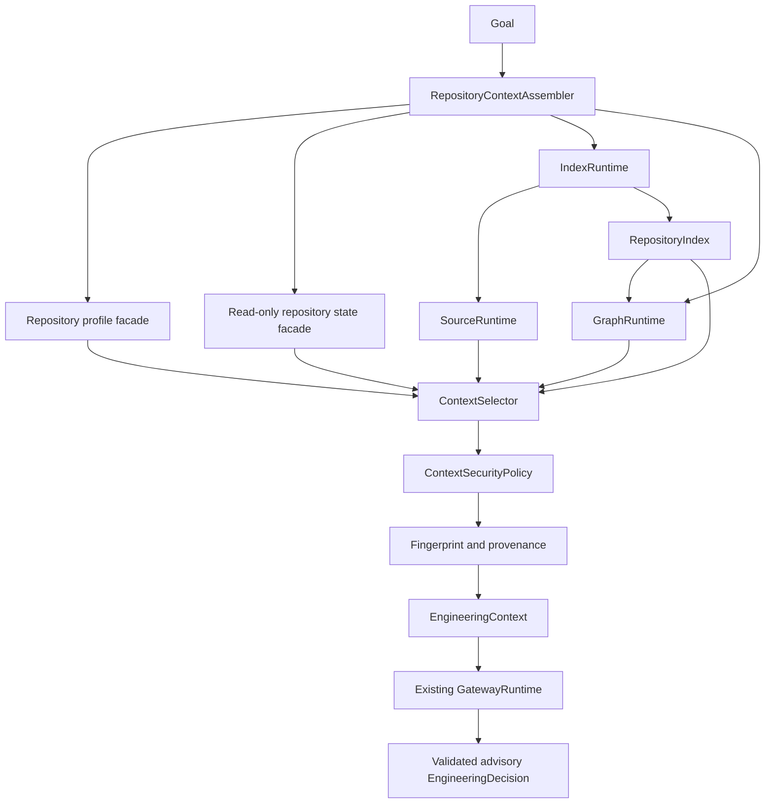

# EAG G2.2 — Contextual Planning & Repository Intelligence

**Design date:** 20 August 2026
**Design baseline:** [`v2.1.0-g2.1`](https://github.com/MenaYassa/EAG/tree/v2.1.0-g2.1) at `98494201bec6ad684a03f89a8232331a3ae77cba`
**Status:** **Implementation Complete; Live Acceptance Pending.** See `G2_2_FINAL_ACCEPTANCE_ASSESSMENT.md` for validation evidence; future EBS-014 execution requires separate authorization and a reliable provider environment.
**Author:** Manus AI

> **Scope boundary.** G2.2 is a read-only repository-understanding milestone. It may construct bounded, provenance-bearing facts for the governed gateway, but it must not write files, delete files, execute shell commands, execute capabilities, modify Git state, commit, push, generate patches, change the default deterministic planner, or begin G2.3.

> **Evidence convention.** **FACT** is directly verified in the G2.1-tagged codebase. **INFERENCE** is a conclusion drawn from that evidence. **RECOMMENDATION** is a future G2.2 implementation decision, not existing behavior.

## G2.1 Closeout Baseline

**FACT.** G2.1 was committed and pushed as `98494201bec6ad684a03f89a8232331a3ae77cba` and tagged `v2.1.0-g2.1`. Its recorded final validation baseline was **3435 passed, 2 skipped**, with EBS-013 passing in its explicit live-provider lane. [1] [2]

**FACT.** `GatewayRuntime` accepts a completed `EngineeringDecisionRequest`, routes and invokes a provider, validates structured output and deterministic policy, then returns either a validated advisory decision or a typed safe failure. It does not discover repositories, instantiate a workspace, or execute capabilities. [3] [4]

**INFERENCE.** G2.2 should supply repository facts before `GatewayRuntime.decide()` and retain the gateway as a generic governed-decision boundary.

---

## 1. Objective

**RECOMMENDATION.** G2.2 should enable EAG to inspect an existing repository and construct a **structured, bounded, provenance-bearing, repository-aware `EngineeringContext`** so that a real LLM can reason about the actual codebase rather than only caller-supplied inputs.

```text
User goal
  → read-only repository discovery and state snapshot
  → source analysis → repository index → dependency graph
  → deterministic relevance selection and secret handling
  → bounded EngineeringContext with provenance/fingerprint/truncation
  → existing Governed LLM Gateway
  → validated advisory EngineeringDecision
```

| Goal | Success condition | Explicitly excluded outcome |
|---|---|---|
| Repository awareness | The provider receives selected facts from the real target repository. | Uploading or rendering the whole repository. |
| Grounded planning | An advisory decision can refer to verifiable files, symbols, tests, constraints, and dependencies. | Treating LLM interpretation as a repository fact. |
| Freshness | Context facts are tied to a reproducible snapshot fingerprint. | Reusing stale context without detection. |
| Safety | Discovery, selection, and provider reasoning remain read-only. | File writes, commands, capability execution, Git mutation, commits, or pushes. |

---

## 2. Current Repository-Intelligence Capabilities

**FACT.** The repository already contains reusable discovery, source analysis, indexing, and graph capabilities. Their contracts should be reused rather than replaced. [5] [6] [7] [8]

| Area | Verified implemented capability | Useful G2.2 facts |
|---|---|---|
| Repository discovery | `RepositoryScanner`, called through `eag.repository.RepositoryRuntime`, walks a repository using `IgnoreEngine` and creates `RepositoryProfile` values with identity, statistics, metadata, capabilities, facts, health, layout, kind, and a scanner fingerprint. [5] [6] | Repository identity, languages, framework/capability observations, aggregate statistics, manifests, project layout, and health. |
| VCS state | `eag.vcs.RepositoryRuntime` has read APIs for status, history, health, branch, and HEAD. [9] | Branch/HEAD and dirty-state evidence, subject to a strict read-only facade. |
| Source analysis | `SourceRuntime` produces per-file `AnalysisResult` values including `SourceFileIdentity` content fingerprints, module, symbols, imports, dependencies, relationships, metrics, and diagnostics. [10] [11] | File-level facts, exact paths/lines, checksums, parse diagnostics, symbols, imports, and relationships. |
| Indexing | `IndexRuntime` discovers/analyzes supported files and creates `RepositoryIndex` inventories for modules, symbols, dependencies, semantic relationships, and aggregate statistics. [7] [12] | Repository-wide structural lookup and candidate inventory. |
| Graph analysis | `GraphRuntime` builds from an index and supports dependencies, dependents, impact, paths, neighbors, and graph metrics. [8] | Direct/transitive impact and structural neighborhood evidence. |
| Exploration | `ExplorerRuntime` queries a built index for overview, symbols, modules, dependencies, and simple searches. [13] | Optional existing read/query presentation, not a context system. |
| Gateway context seam | `EngineeringContextAssembler` and `DefaultEngineeringContextAssembler` exist in the G2.1 gateway package. [4] | A public generic contract to implement without coupling the gateway to repository infrastructure. |

**INFERENCE.** The raw ingredients for repository-aware context exist, but they have never been composed as a safe, bounded, provider-facing context snapshot.

---

## 3. Current Integration Gaps

**FACT.** Repository/source/index/graph runtimes are constructed ad hoc by CLI flows and are not connected to the canonical G2.0 autonomous factory, Chief, or the G2.1 gateway path. [7] [8] [14]

| Gap | Evidence | Consequence for current LLM decisions |
|---|---|---|
| Minimal context assembly | The G2.1 default assembler echoes caller goal/path/capabilities/constraints and records `source_content_included: False`. [4] | Gateway context is repository-unaware. |
| No relevance selection | `RepositoryIndexBuilder` aggregates inventories but does not rank candidates or preserve a selection rationale. [15] | A caller has no deterministic way to choose the right files/symbols. |
| Lost per-file evidence | Index aggregation preserves structure but not file diagnostics, excerpts, provenance, or freshness metadata. [15] | A later decision cannot explain the exact observation behind a fact. |
| No context freshness key | Scanner fingerprinting includes time, so identical contents produce different values. [6] | Existing fingerprint cannot detect or control stale context reuse. |
| No sensitivity layer | `IgnoreEngine` handles caches/build artifacts but has no secret/sensitive-file policy or redaction. [16] | Raw repository content is not safe to include by default. |
| Effectful neighboring services | Workspace and VCS domains expose write/mutation operations in addition to useful read APIs. [9] [17] | G2.2 must explicitly constrain its dependency surface to read-only methods. |
| Graph limitations | Semantic relation support is limited by available enums and resolution can fall back to heuristic short-name matching. [18] | Graph relations require provenance and confidence; they cannot be asserted as absolute truth. |
| No gateway composition | G2.0 factory deliberately composes deterministic services and omits source/index/graph/gateway services. [14] | G2.2 needs a separate opt-in assembly path, not a hidden default planner change. |

**RECOMMENDATION.** G2.2 should close these composition, selection, provenance, freshness, and safety gaps only. It should not replace existing scanners, parsers, indices, graphs, VCS services, workspace services, model routing, memory, reflection, or scheduling.

---

## 4. Repository Context Architecture

**RECOMMENDATION.** Add a small non-effectful `eag.context` orchestration/projection layer. It should construct a read-only snapshot from existing services, deterministically select relevant evidence, apply sensitivity policy, and project the result into the gateway’s generic `EngineeringContext`.



| Component | Proposed owner | Owns | Must not own |
|---|---|---|---|
| `RepositoryDiscoveryFacade` | `eag.context` adapter over existing repository/VCS services | Read-only profile and state retrieval, normalized discovery errors. | Parsing, provider calls, Git mutation. |
| `RepositoryContextSnapshot` | `eag.context.models` | Immutable composition inputs, artifact references, snapshot state, sensitivity outcomes, provenance. | A duplicate repository/index data model. |
| `ContextSelector` | `eag.context.selection` | Ranking, stable ordering, budget allocation, omission accounting. | LLM routing, filesystem writes, mutations. |
| `ContextSecurityPolicy` | `eag.context.sensitivity` | Path/content exclusion, redaction, audit reason codes. | Storing secrets or credentials. |
| `RepositoryContextAssembler` | `eag.context.runtime`, implementing the existing gateway protocol | Snapshot construction and projection into generic context. | Provider execution, policy validation, capability execution. |
| Existing `GatewayRuntime` | G2.1 gateway package | Model selection, provider call, output validation, typed safe failure. | Repository/source/index/graph imports or filesystem access. |

**RECOMMENDATION.** G2.2 must not inject an LLM planner into Chief or replace `DefaultPlanner`. An assembler may be introduced in a deliberately invoked read-only decision/benchmark path, while the canonical autonomous build path remains deterministic. [14] [19]

---

## 5. Context Selection Strategy

**RECOMMENDATION.** Context selection must be deterministic, goal-conditioned, explainable, and budgeted. It must have a stable tie-breaker: normalized relative path, then qualified symbol name, then source range. Unordered collection traversal may not affect selection.

| Rank band | Candidate source | Deterministic selection rule |
|---|---|---|
| 1 — Explicit target | Exact file/module/symbol identifiers or configured aliases matched from the goal. | Select direct matches first. |
| 2 — Contract/test evidence | Public exports, typed interfaces, routes/config/manifests, and tests mentioning rank-1 candidates. | Select the nearest contract and validating test. |
| 3 — Direct structure | One-hop imports, dependencies, dependents, graph neighbors, containment parent/children. | Select only items that connect to rank-1/2 evidence. |
| 4 — Impact expansion | Capped graph impact/transitive relations. | Use only for goals that imply changes, compatibility, or impact. |
| 5 — Repository constraints | Profile facts, package metadata, CI/type/lint/test configuration, architecture docs. | Include concise selected facts, not unrelated raw configuration. |
| 6 — Broad lexical fallback | Path/module/symbol/documentation token matches. | Use only when direct structure is insufficient, and label lower confidence. |

The selector should calculate a reproducible score from exact goal match, symbol/path overlap, test relationship, graph distance/direction, role importance, and configuration relevance. Its raw score is retained in provenance; the provider receives human-readable reason codes and selected evidence.

**INFERENCE.** Existing index and graph APIs provide structural candidate sets but not semantic relevance. A separate selector above those APIs is therefore the smallest non-duplicative G2.2 addition. [7] [8] [15]

---

## 6. EngineeringContext Contract

**FACT.** G2.1’s immutable `EngineeringContext` already has fields for repository identity and summary, source findings, relevant symbols, constraints, available capabilities, prior evidence, provenance, and truncation metadata. [20]

**RECOMMENDATION.** Preserve the generic model and fill it through a future repository-aware assembler. The internal full snapshot is not provider-facing; the provider gets only a selected, redacted projection.

```python
@dataclass(frozen=True, slots=True, kw_only=True)
class RepositoryContextSnapshot:
    repository_profile: RepositoryProfile
    repository_state: RepositoryStateEvidence
    index: RepositoryIndex
    graph: GraphSnapshot
    source_artifacts: tuple[SourceArtifactRecord, ...]
    snapshot_fingerprint: str
    assembled_at: datetime
    policy_id: str

@dataclass(frozen=True, slots=True, kw_only=True)
class SelectedRepositoryContext:
    factual_summary: tuple[RepositoryFactView, ...]
    file_refs: tuple[FileReference, ...]
    symbol_refs: tuple[SymbolReference, ...]
    dependency_refs: tuple[DependencyReference, ...]
    test_refs: tuple[TestReference, ...]
    excerpts: tuple[SourceExcerpt, ...]
    provenance: tuple[ContextProvenanceRecord, ...]
    truncation: ContextTruncationReport
    context_fingerprint: str
```

| Provider-facing item | Include? | Representation |
|---|---|---|
| Repository identity/state | Yes | Relative/logical identity, project kind/layout, clean/dirty state, branch/HEAD digest where permitted, analysis time, snapshot fingerprint. No absolute host path by default. |
| Profile facts | Yes | Languages, package manager, test/CI/type/lint capabilities, aggregate statistics, selected manifest/readme/config references. |
| Files and symbols | Yes | Relative path, role/language, fingerprint, qualified symbol, kind, module, line range, selection reason, bounded excerpt if permitted. |
| Dependencies/impact | Yes | Normalized direct/transitive relation, source/target, relationship type, resolution confidence, and provenance ID. |
| Test evidence | Yes | Relevant test paths, symbols/fixtures, and how they constrain the requested change. |
| Diagnostics/limitations | Yes | Parse failures, unsupported languages, unresolved edges, omitted evidence, and stale-context warning. |
| Full files/repository dump/binaries/cache/.git | No | Unbounded and unnecessary for advisory reasoning. |
| Secret values, credentials, tokens, private keys, raw `.env` data | No | Never in prompt, events, provenance, fingerprints, or logs. |
| LLM architecture interpretations | No as facts | Keep them inside the later advisory `EngineeringDecision`. |

**RECOMMENDATION.** Add context fingerprint and structured grounding/provenance references additively and version the contract if serialisation changes. The generic gateway prompt can continue to render context fields, but no repository code should enter `GatewayRuntime`.

---

## 7. Provenance Model

**RECOMMENDATION.** Every retained fact, file reference, excerpt, relation, and omission should have a machine-readable provenance record. Provenance separates deterministic source observations from deterministic derivations and provider-produced interpretation.

| Field | Purpose |
|---|---|
| `provenance_id` | Stable reference used by facts, excerpts, and later decision citations. |
| `kind` | `repository_profile`, `git_state`, `source_analysis`, `index`, `graph_query`, `file_excerpt`, `test_reference`, `config_summary`, or `selection_rule`. |
| `subject` | Relative file path, qualified symbol, metadata key, or graph node identifier. |
| `source_fingerprint` | File/content fingerprint or snapshot fingerprint controlling the observation. |
| `location` | Optional relative path and line range; never an absolute host path. |
| `derivation` | Analyzer/provider version, graph query, or selector policy/version. |
| `selection_reason` | Stable code such as `goal_exact_match`, `direct_dependent`, or `nearest_test`. |
| `resolution_confidence` | Exact, resolved, heuristic, external, or unresolved classification. |
| `sensitivity_action` | `included`, `redacted`, or `excluded`, with rule ID but no secret value. |

> **Definition.** A repository fact is an observation or deterministic derivation tied to fingerprinted source evidence. An LLM conclusion is advisory output in `EngineeringDecision` and must not be stored as a repository fact without independent verification.

**RECOMMENDATION.** A future provider decision should be able to refer to a `provenance_id` or selected file/symbol reference. Validation should reject references that do not resolve to the selected snapshot, but should not require the model to reproduce one particular natural-language explanation.

---

## 8. Repository Fingerprinting

**FACT.** The current scanner fingerprint includes the present time, so it changes even for an unchanged repository and is unsuitable for stale-context detection. [6]

**RECOMMENDATION.** Define a separate deterministic `RepositorySnapshotFingerprint`; do not casually change scanner semantics. Hash canonical JSON with sorted keys and normalized relative paths containing:

1. schema/version and normalized logical repository identity;
2. Git HEAD plus branch/detached state when available, and normalized dirty-status entries without content;
3. sorted selected-file records of relative path, content/source fingerprint, language, size, and analysis status;
4. redaction-aware digests for selected safe manifest/config metadata;
5. source/index/graph analyzer versions, selector policy/version, and security policy/version; and
6. an exclusion summary using counts/path hashes where raw paths need protection.

Timestamps are observational metadata and must not affect equality. A separate `context_fingerprint` should hash the selected/redacted provider projection plus the snapshot fingerprint, budget, and contract version.

| Situation | Required behavior |
|---|---|
| Selected file changed/disappeared/changed classification | Reject reuse and rebuild or return a typed insufficiency failure. |
| Git state changes | Mark context stale and rebuild state/profile/selection. |
| Analyzer, selector, gateway-context schema, or security policy changes | Rebuild because deterministic output may differ. |
| Unselected file changes | Re-evaluate state/profile; permit selective reuse only after a separately proven impact-safe optimization. |
| Equal fingerprint within policy TTL | Reuse is eligible, not mandatory. |

---

## 9. Secret/Sensitive-File Handling

**FACT.** `IgnoreEngine` currently excludes Git, virtual environments, caches, build artifacts, and compiled files. It does not classify sensitive files or redact content. [16]

**RECOMMENDATION.** Layer a `ContextSecurityPolicy` above existing ignore behavior. Apply it before parsing excerpts, provenance rendering, telemetry, fingerprint rendering, and provider prompt construction.

| Control | First implementation rule |
|---|---|
| Path exclusion | Exclude `.env`, `.env.*`, private key/certificate files (`*.key`, `*.pem`, `*.p12`, `*.pfx`), common credential files/paths, SSH material, `secrets/`, `credentials/`, policy-configured patterns, and policy-sensitive package config. |
| Repository ignore | Honor repository ignore behavior but never assume a tracked file is safe to disclose. |
| Content redaction | Detect common token/key assignments and redact values before any prompt/event/fingerprint serialization; record only count and rule ID. |
| Binary/oversize controls | Exclude binary and over-limit files before parsing/excerpting. |
| Safe metadata allowlist | Permit dependency names and public configuration keys without confidential values. |
| Fail closed | Exclude any file that cannot be classified/redacted safely and retain a non-sensitive omission reason. |
| Telemetry | Emit counts, stable IDs, fingerprints, and reason codes only; never raw source, prompt, secret, or unredacted provider output. |

Repository source must be treated as untrusted data, not instruction. This preserves G2.1’s deterministic policy boundary outside provider and repository content. [3]

---

## 10. Context-Size/Budget Strategy

**RECOMMENDATION.** Context budget must be enforced before provider invocation. It is a safety and correctness control, not merely a cost limit.

| Dimension | Recommended first limit | Deterministic pressure behavior |
|---|---:|---|
| Repository profile summary | 1,500 characters | Retain high-priority profile facts; report low-priority omissions. |
| File references | 16 files | Keep higher rank then stable ties; record counts and safe omitted references. |
| Symbol references | 50 symbols | Preserve target/test symbols before graph-neighbor symbols. |
| Dependency references | 60 relations | Prefer direct edges; cap initial transitive depth at 2. |
| Excerpts | 12 excerpts | One per selected file except named-symbol needs. |
| Excerpt span | 80 lines / 6,000 characters each | Anchor around selected symbol lines and truncate with explicit line bounds. |
| Total factual text | Configurable; initial default 24,000 characters | Remove broad lexical candidates, then relation detail, then excerpts; never remove fingerprint/provenance/omission report. |
| Sensitive material | 0 raw secret values | Exclude/redact before selection accounting and all serialization. |

The context must record configured limits, actual usage, excluded/reduced counts, and insufficiency. If a required explicit target cannot safely fit, return a typed assembly failure or explicit constraint rather than silently substitute unrelated context.

---

## 11. LLM Integration Boundary

**RECOMMENDATION.** Implement `RepositoryContextAssembler` as a concrete implementation of the existing `EngineeringContextAssembler` protocol. A future caller passes the goal, repository location/identity, known constraints, and allowed capability IDs; the assembler returns a completed generic `EngineeringContext`. [4] [20]

| Layer | G2.2 responsibility | Must remain unchanged |
|---|---|---|
| Context assembler | Discover, select, redact, fingerprint, record provenance, and project facts. | No provider call, plan execution, capability dispatch, shell, or mutation. |
| Engineering context | Carry bounded factual summary/findings/symbols/evidence/provenance/truncation. | Immutable and factual gateway input. |
| Gateway | Render generic context, route provider, call provider, validate result, emit redacted events. | No repository/source/index/graph/workspace dependency. |
| Decision translator | Translate an already accepted decision to a Plan only if a later caller explicitly asks. | No execution; unchanged G2.1 behavior. [19] |
| Chief/Coordinator | Remain deterministic build control plane. | No global LLM planner, no `eag build` migration. [14] |

**INFERENCE.** `GatewayRuntime` should not evaluate repository freshness itself. Context assembly owns snapshot validity, while the gateway owns safe model invocation and decision validation.

---

## 12. EBS-014 Design

**RECOMMENDATION.** Add **EBS-014 — Repository-Aware Engineering Decision** as an explicit credentialed live-provider benchmark, patterned after EBS-013’s opt-in real-provider discipline. [1] [2]

The fixture should be an independent, small but nontrivial Python repository with a documented architecture, controller/route module, domain/service module, package/configuration manifest, and relevant tests. The benchmark request should name a real compatibility-sensitive engineering change, for example:

> **“Plan pagination support for the existing article-list endpoint while preserving its current response contract and extending the relevant tests.”**

```text
Fixture repository
  → actual scanner + read-only state facade
  → actual SourceRuntime → IndexRuntime → GraphRuntime
  → actual G2.2 assembler/selector/sensitivity policy
  → actual configured G2.1 gateway and real provider
  → actual schema/policy validation
  → deterministic repository-grounding evaluator
```

| Acceptance condition | Required evidence |
|---|---|
| Actual EAG intelligence stack | Real profile, index, graph, selected context, nonempty provenance, fingerprint, and truncation evidence are created from the fixture. |
| Actual provider call | Gateway trace records actual configured provider/model and nonzero usage; static/fake decision responses fail acceptance. |
| Grounded paths | Every cited path exists and resolves to selected fixture provenance/fingerprint. |
| Grounded symbols | Every cited symbol resolves via the actual index/graph and is selected or deterministically related to selection. |
| Architecture awareness | Decision recognizes actual fixture framework/configuration constraints rather than proposing incompatible replacement architecture. |
| Test awareness | At least one existing relevant test is selected/cited and the advisory plan names test work without creating a file. |
| Dependency awareness | Decision identifies an actual dependency/dependent or a verified lack of impact. |
| Assumptions/risks | Includes context omissions, unresolved relations, and/or response-contract risk as appropriate. |
| Read-only proof | Capability executions, workspace writes, Git mutations, shell invocations, commits, and pushes are each **zero**. |

The evaluator must resolve claims against fixture facts/provenance rather than compare prose to a single hardcoded answer. Hidden fixture variants may rename symbols or alter dependency paths to resist template gaming. Normal suites should skip EBS-014 without explicit opt-in credentials, and a skip must never be reported as a pass.

---

## 13. Unit/Integration/Live Test Strategy

| Test level | Target | Required assertions |
|---|---|---|
| Unit | Read-only repository-state facade | Allowlisted read calls; malformed/non-Git handling; no mutation methods surfaced. |
| Unit | Snapshot/context fingerprints | Stable ordering; equal input equals hash; file/state/policy/version changes alter hash; timestamps do not. |
| Unit | Sensitivity policy | Ignore reuse, `.env`/key/token exclusions, value redaction, binary/oversize exclusion, fail-closed behavior. |
| Unit | Context selection | Exact goal/file/symbol/test ranking, graph-neighborhood ranking, deterministic ties, limits, omissions, empty repository. |
| Unit | Excerpting and provenance | Symbol-line anchors, deterministic truncation, source ranges, unique provenance, no absolute-path leakage. |
| Unit | Context projection | Selected snapshot becomes valid immutable `EngineeringContext`; gateway package does not import repository infrastructure. |
| Integration | Discovery to context | Fixture scan → source analysis → index → graph → selected context; diagnostic/unsupported-language behavior. |
| Integration | Stale detection | Change selected file/state/policy after assembly; require rebuild/rejection before decision. |
| Integration | Gateway boundary | Actual G2.1 selection/execution/validator with controlled transport receives generic context and emits only redacted event data. |
| Live provider | EBS-014 | Actual context stack and actual configured G2.1 provider; grounding, trace/usage, schema/policy, and zero-effect assertions. |
| Regression | G2.0/G2.1 | Full suite, autonomous suite, EBS-010–013, gateway tests, and default CLI behavior remain unchanged. |

**RECOMMENDATION.** Large-repository fixtures should verify bounded selection rather than prompt the entire fixture. Malformed repositories must surface typed diagnostics/insufficiency and must never cause invented facts.

---

## 14. Migration Path

| Stage | Change | Validation gate | Scope protection |
|---|---|---|---|
| G2.2-A | Define immutable snapshot/selection/provenance/budget/sensitivity/fingerprint contracts. | Ordering, fingerprint, redaction, and zero-effect unit tests. | No gateway, Chief, or planner behavior change. |
| G2.2-B | Add read-only adapters over repository profile/state, source/index, and graph. | Actual fixture scan/index/graph integration test. | Reuse existing runtime outputs; no duplicate parser/index/graph. |
| G2.2-C | Implement deterministic selector and excerpt renderer. | Bounded, relevant-file/symbol/test, dependency, large/empty/malformed fixture tests. | No model call and no workspace/VCS mutation. |
| G2.2-D | Implement `RepositoryContextAssembler` using existing generic protocol. | Context projection and stale/rebuild integration tests. | Gateway remains repository-unaware. |
| G2.2-E | Add EBS-014 safe-mode skip and explicit credentialed live lane. | Real-provider grounding, usage/trace, zero-effect acceptance. | No `LLMPlanner`, `eag build` migration, or decision execution. |
| G2.2-F | Publish implementation evidence and reassess later shadow-planner work. | Release checklist. | G2.3 requires separate approval. |

---

## 15. Risks

| Risk | Why it matters | Control |
|---|---|---|
| Context overload | Source volume dilutes relevance, raises cost, and expands untrusted prompt surface. | Multi-dimensional budget, rank bands, deterministic truncation, omission report. |
| Stale grounding | Decisions can reference changed/deleted code. | Snapshot/file fingerprints, state checks, policy/version binding, mandatory rebuild/rejection. |
| Secret disclosure | Prompts/events can leak repository credentials. | Layered path exclusion/redaction, fail closed, no raw content telemetry. |
| False graph confidence | Heuristic/narrow semantic resolution can be incomplete or wrong. | Resolution confidence, provenance, explicit unresolved/external relations. [18] |
| Unsupported language/provider failure | Analysis or live decision may not be available. | Explicit diagnostic facts, typed insufficiency, preserved gateway safe failure. |
| Subsystem duplication | Context code could reimplement scanner/index/graph behavior and drift. | Adapter/selector-only ownership and tests against existing outputs. |
| Hidden effects | Nearby workspace/VCS APIs have mutations. | Constrained read facades, zero-effect tests/counters, no capability runtime in EBS-014. |
| Benchmark gaming | Plausible prose can be ungrounded. | Validate paths/symbols/relations against provenance and hidden fixture variants. |

---

## 16. Non-Goals

| Excluded work | Reason |
|---|---|
| Repository mutation, patch generation, code application, or test execution | Belongs to G2.3 or a later separately authorized action path. |
| Capability, shell, tool, workspace, Git, commit, or push execution from provider output | Violates G2.1’s decision/execution separation. |
| Chat UI, frontend, persistent conversation, or deployment UX | Not necessary to prove repository-aware advisory reasoning. |
| Gateway/provider/routing/LiteLLM redesign | G2.1 owns these boundaries; G2.2 supplies generic context. |
| DefaultPlanner replacement, LLMPlanner rollout, or `eag build` migration | Requires later planner/shadow/execution approval. |
| Engineering Memory, Reflection, Scheduler, worker, review, or benchmark-platform redesign | Separate systems that would dilute the read-only G2.2 goal. |

---

## 17. Definition of Done

G2.2 is complete only when the implementation demonstrates all of the following:

1. Existing repository/source/index/graph systems are reused via explicit read-only adapters rather than duplicated.
2. Assembly produces immutable profile, state, file, symbol, dependency, test, provenance, fingerprint, and truncation evidence under deterministic policy.
3. Selection is bounded, deterministic, sensitivity-aware, and fails explicitly when sufficient safe evidence cannot be assembled.
4. Fingerprints are reproducible; stale context is rejected or rebuilt for relevant repository/state/policy changes.
5. The gateway receives only generic completed `EngineeringContext` and remains free of repository implementation dependencies.
6. Tests cover discovery, selection, secret exclusion, ordering, excerpts, provenance, fingerprints, staleness, empty/malformed/large repositories, and zero-effect guarantees.
7. EBS-014 uses actual EAG repository intelligence and an actual configured G2.1 provider, produces a valid grounded advisory decision, and records zero capability/workspace/Git/shell effects.
8. Default deterministic Chief/Coordinator/CLI build behavior remains unchanged and full regressions stay green.
9. The implementation report distinguishes skipped and passed live benchmarks, records real-provider trace/usage evidence, limitations, and exact commit/push state.

---

## 18. Files Expected to Change

The following is a narrow **future implementation forecast only**. This document does not authorize any source modification.

| File or area | Expected future change | Ownership guard |
|---|---|---|
| `src/eag/context/models.py` | **New.** Snapshot, provenance, selection, budget, fingerprint, redaction, and typed context error models. | Does not duplicate `RepositoryProfile`, `RepositoryIndex`, or `EngineeringContext`. |
| `src/eag/context/runtime.py` | **New.** Read-only composition from repository/source/index/graph evidence to selected context. | No provider or capability imports. |
| `src/eag/context/selection.py` | **New.** Deterministic candidate scoring/ranking/budget policy. | No filesystem mutation or LLM call. |
| `src/eag/context/fingerprint.py` | **New.** Canonical snapshot/context fingerprinting. | No nondeterministic time hash. |
| `src/eag/context/sensitivity.py` | **New.** Context-specific exclude/redaction policy layered over ignore behavior. | Never stores raw secret values. |
| `src/eag/chief/intelligence/gateway/context.py` | Additive request/options support and connection to a protocol-conforming assembler. | Gateway remains repository-unaware. |
| `src/eag/chief/intelligence/gateway/models.py` | Additive context fingerprint/provenance/truncation and, if needed, versioned grounding references. | Preserve G2.1 safe-failure/validation semantics. |
| `src/eag/chief/intelligence/gateway/events.py` | Safe context snapshot/selection/staleness events with counts/IDs only. | No source/prompt/secret payload. |
| `src/eag/repository/*`, `src/eag/index/*`, `src/eag/graph/*` | At most narrow read-only public accessors/factories required by adapters. | Do not rewrite those subsystems. |
| `tests/test_repository_context_*.py` | **New.** Unit/integration coverage for selection, provenance, sensitivity, fingerprints, staleness, and no effects. | Deterministic fixtures; no hardcoded LLM answer. |
| `tests/test_ebs_014_repository_aware_decision.py` | **New.** Opt-in real-provider EBS-014. | Actual context/gateway/provider and zero effects. |
| `tests/fixtures/ebs_014_*` | **New.** Independent known repository fixture and hidden variants as appropriate. | Read-only test input. |
| `docs/architecture/G2.2_*` and future implementation report | Update evidence after an approved implementation. | Documentation does not substitute for tests. |

## References

[1]: https://github.com/MenaYassa/EAG/blob/v2.1.0-g2.1/G2_1_IMPLEMENTATION_REPORT.md "G2.1 implementation report"
[2]: https://github.com/MenaYassa/EAG/blob/v2.1.0-g2.1/tests/test_ebs_013_governed_decision.py "EBS-013 governed-decision benchmark"
[3]: https://github.com/MenaYassa/EAG/blob/v2.1.0-g2.1/src/eag/chief/intelligence/gateway/runtime.py "G2.1 GatewayRuntime"
[4]: https://github.com/MenaYassa/EAG/blob/v2.1.0-g2.1/src/eag/chief/intelligence/gateway/context.py "G2.1 EngineeringContextAssembler boundary"
[5]: https://github.com/MenaYassa/EAG/blob/v2.1.0-g2.1/src/eag/repository/runtime.py "Repository runtime"
[6]: https://github.com/MenaYassa/EAG/blob/v2.1.0-g2.1/src/eag/repository/scanner.py "Repository scanner"
[7]: https://github.com/MenaYassa/EAG/blob/v2.1.0-g2.1/src/eag/index/runtime.py "Index runtime"
[8]: https://github.com/MenaYassa/EAG/blob/v2.1.0-g2.1/src/eag/graph/runtime.py "Graph runtime"
[9]: https://github.com/MenaYassa/EAG/blob/v2.1.0-g2.1/src/eag/vcs/runtime.py "VCS repository runtime"
[10]: https://github.com/MenaYassa/EAG/blob/v2.1.0-g2.1/src/eag/source/runtime.py "Source runtime"
[11]: https://github.com/MenaYassa/EAG/blob/v2.1.0-g2.1/src/eag/source/models.py "Source models"
[12]: https://github.com/MenaYassa/EAG/blob/v2.1.0-g2.1/src/eag/index/models.py "Repository index model"
[13]: https://github.com/MenaYassa/EAG/blob/v2.1.0-g2.1/src/eag/explorer/runtime.py "Explorer runtime"
[14]: https://github.com/MenaYassa/EAG/blob/v2.1.0-g2.1/src/eag/autonomous/factory.py "Canonical autonomous composition"
[15]: https://github.com/MenaYassa/EAG/blob/v2.1.0-g2.1/src/eag/index/builder.py "Repository index builder"
[16]: https://github.com/MenaYassa/EAG/blob/v2.1.0-g2.1/src/eag/repository/ignore.py "Repository ignore engine"
[17]: https://github.com/MenaYassa/EAG/blob/v2.1.0-g2.1/src/eag/workspace/runtime.py "Workspace runtime"
[18]: https://github.com/MenaYassa/EAG/blob/v2.1.0-g2.1/src/eag/graph/builder.py "Graph builder"
[19]: https://github.com/MenaYassa/EAG/blob/v2.1.0-g2.1/src/eag/chief/runtime/planner.py "Default deterministic planner"
[20]: https://github.com/MenaYassa/EAG/blob/v2.1.0-g2.1/src/eag/chief/intelligence/gateway/models.py "G2.1 context and decision models"
